# PDM Final Project Lifecycle — Workflow Map, Friction Register & Product Scope

**Project:** Digitization of the PDM Final Project Lifecycle
**Programme:** M.Tech Product Design & Management (PDM), IIIT Hyderabad
**Cohort studied:** PDM 2025–2027 (Semester 3 → Semester 4 final project)
**Document owner:** Sri Peri Charan
**Version:** 1.0 · 12 September 2026 (Week 5)
**Status:** Working document — every claim is tagged `[KNOWN]`, `[PARTIAL]` or `[ASSUMED]`. Nothing tagged `[ASSUMED]` may be built on without validation.

---

## 1. How to read this document

This is the **current-state (as-is) and target-state (to-be) workflow map** for the PDM final project. It exists to do four things, in this order:

1. **Describe the whole process** as it actually runs today, stakeholder by stakeholder.
2. **Name the friction** — where the process loses information, time, or visibility.
3. **Draw the line** between what the application will and will not do.
4. **Separate evidence from assumption**, so the Week 3–6 research programme has a target list.

A companion document, [`02-feature-catalogue-moscow.md`](./02-feature-catalogue-moscow.md), turns every friction point named here into a prioritised feature.

### Evidence tags used throughout

| Tag | Meaning | Source |
|---|---|---|
| `[KNOWN]` | Documented in a primary artefact we hold | Milestone PDF, project proposal, batch registration form, programme communication |
| `[PARTIAL]` | Partly documented, partly inferred | Mixed |
| `[ASSUMED]` | Our working assumption, **not yet validated** | Team inference — must be tested in interviews |

> **Discovery discipline.** The project proposal (§2, §7) explicitly states that no software solution is assumed necessary and that a predefined feature set is not to be presumed. This document therefore maps the process first and derives product scope last. Anything marked `[ASSUMED]` is a research task, not a requirement.

---

## 2. The programme at a glance

### 2.1 Cohort structure `[KNOWN]`

| Attribute | Value |
|---|---|
| Batch | PDM 2025–2027 |
| Students in batch | ~41–43 (roll numbers 2025204001–2025204042, plus carry-over roll 2024204015) |
| Project teams | **22** |
| Typical team size | 2 students (3 teams are individual projects) |
| Faculty mentors | **4 mentoring lines** |
| Mentor load | 6–8 teams per mentor (uneven by design; one mentor carries 8, one carries 6) |
| Programme coordinator | 1 |
| Project duration | ~28 teaching weeks, spanning Semester 3 and Semester 4 |

### 2.2 Mentor allocation as recorded today

| Mentor | Teams (per the batch registration form) | Notes |
|---|---|---|
| Prakash Yalla | 6 | |
| Dr. Raman Saxena | 10 (as recorded) | Recorded load exceeds the stated 6–8 band — **needs reconciliation**. Also publicly listed as the **Programme Coordinator** ([PDM About](https://pdm.iiit.ac.in/about/)) — see §14.3 |
| Dr. Raghu Reddy | 6 | Co-mentors with **Ramesh Loganathan** `[PARTIAL]` |
| Ramesh Loganathan | Co-mentor, not separately allocated in the form | |
| Manisha | **Not present in the registration data we hold** | Named as a mentor by the programme — **data gap** |

> ⚠ **Open data issue O-1.** The allocation we hold (from the batch's project registration form) lists four mentor identities — Prakash Yalla, Raman Saxena, Raghu Reddy, Ramesh Loganathan — with a 6 / 10 / 6 / co-mentor split. The programme describes the mentoring lines as Manisha, Raman Saxena, Raghu (with Ramesh Loganathan) and Prakash Yalla with a 6 / 7 / 8 split. **The authoritative allocation must be confirmed with the coordinator before the app's roster is treated as real.** Until then the app's directory is a draft, not a record.

### 2.3 The programme milestone structure `[KNOWN]`

Source: *PDM Project — Milestones · Activities · Deliverable · Suggested Timelines (2026)*.

| # | Semester | Milestone / phase | Key activities | Deliverable | Due |
|---|---|---|---|---|---|
| 1 | Sem 3 | **Product Scope** | Product/business vision statement; potential customer; assumed primary need; initial idea; key benefits & customer value; competitive alternatives; key differentiator. High-level project plan incl. effort, timelines, risks & mitigation | **Detailed Project Plan** | **Week 4** |
| 2 | Sem 3 | **Domain Research Report** | Technical aspects/trends; competitors; market — existing products/solutions | **Domain Research Report** | **Week 6** |
| 3 | Sem 3 | **Customer Discovery** — validation | Customer discovery plan & methods; identify target customer; document assumptions (testable, specific, one thing each); test assumptions with customers; validate the customer's problem | **Customer Validation Report** | **Week 8** |
| 4 | Sem 3 | **Customer Discovery** — idea test | Validate the idea solves the problem; willingness to pay; profitability | **Idea Validation Report** | **Week 10** |
| 5 | Sem 3 | **Customer Discovery** — research | Research goals & objectives; research methods & tools; interview/survey/focus-group instruments; personas; user goals & needs; pain points; perceived gains; customer journey map; product requirement & prioritised feature list; market opportunity | **Selected Research Tools · Questionnaire · User Personas · User Requirement Document · Pain-point & Gains docs · Customer Journey Map · Product Feature List (prioritised) · Market Opportunity** | **Week 14** |
| 6 | Sem 3 | **Define Actionable Problem Statement** | Customer point-of-view statements; value proposition; How-Might-We statements | **Value Proposition Map · Articulated Actionable Problem Statement** | **Week 16** |
| 7 | Sem 4 | **Ideate Solution & Build MVP** | Ad-lib statements; idea screening matrix; solution–customer fit; prioritise feature list | **List of Ideas · Screening Matrix · Customer Profile/Value Map/Fit** | **Week 18** |
| 8 | Sem 4 | **Ideate Solution & Build MVP** — build | Create low-fidelity prototype / MVP | **Low-Fidelity Prototype / MVP** | **Week 21** |
| 9 | Sem 4 | **Update Project Scope** | Update project plan; update product requirement document | **Updated Project Plan & Deliverables** | **Week 22** |
| 10 | Sem 4 | **Hi-Fidelity Project Plan** | Build hi-fidelity prototype | **Hi-Fidelity Prototype** | **Week 25** |
| 11 | Sem 4 | **User Validation** | Customer validation plan; conduct validation; analyse results | **Validation Matrix · Validation Report** | **Week 26** |
| 12 | Sem 4 | **Go-to-Market Strategy** | Develop GTM strategy | **Go-to-Market Strategy Document** | **Week 28** |

**Counted as phases:** 7 named milestone blocks. **Counted as dated deliverable checkpoints:** 12.

> ⚠ **Open data issue O-2 — "9 stages".** The programme is commonly described as having **9 stages**. The milestone sheet resolves to 7 phases / 12 checkpoints. The proposal's own product-development progression is 9 steps — *Understand → Research → Define → Prioritize → Design → Prototype → Validate → Iterate → Handoff*. **Which "9" the programme means must be confirmed**, because the application's stage model is built directly on it. The app should therefore model stages as **configurable data, not hard-coded enums** (see Scope §9).

### 2.4 The column nobody has filled in `[KNOWN]`

The milestone sheet carries a final column — **Community Presentation** — which is **entirely blank** for every milestone. This is significant: the programme has reserved a slot for a cohort-wide presentation event per milestone but has not scheduled or defined it. It is either (a) not yet planned, (b) planned informally outside the sheet, or (c) abandoned. **Research question for the coordinator.** `[ASSUMED]` interpretation: community presentations are the cohort's main cross-team learning moment and are currently unmanaged.

---

## 3. Stakeholders

> ⚠ **Read §14.3 before treating these as three separate people.** The institute's own faculty page lists **Dr. Raman Saxena as "Professor & Program Coordinator"** — meaning the programme coordinator is also one of the mentoring faculty. The three roles below are *functions*, not necessarily three humans.

### 3.1 Stakeholder map

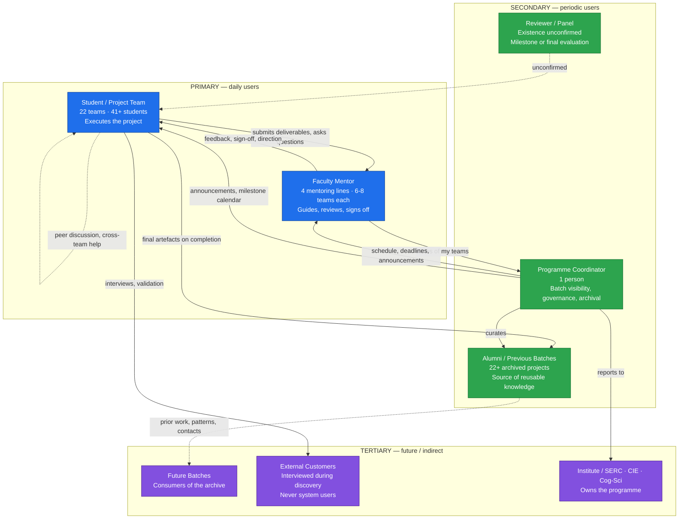

### 3.2 What each stakeholder is trying to do

| Stakeholder | Core job-to-be-done | Success looks like | Current pain `[ASSUMED unless noted]` |
|---|---|---|---|
| **Student / team** | Move the project from a vague idea to a validated MVP + GTM across 28 weeks without losing work or missing a checkpoint | Every deliverable submitted on time, mentor feedback acted on, nothing re-done twice | Deliverables scattered across Drive/WhatsApp/laptop; action items from meetings forgotten `[PARTIAL — proposal §3]`; no single view of "what's due next" |
| **Faculty mentor** | Guide 6–8 teams, review work, give feedback, know which team is drifting | Walks into a review already knowing the state; feedback is acted on and visible | Re-asks students for the same context `[ASSUMED]`; no cross-team view `[PARTIAL — proposal §2]`; broadcasts the same message to 8 teams one at a time |
| **Programme coordinator** | Know the health of 22 projects; run the calendar; govern allocation, completion and archival | One screen showing all 22 projects against 12 checkpoints | No batch-level dashboard `[PARTIAL — proposal §9.6]`; health is discovered by asking mentors |
| **Reviewer / panel** | Evaluate work at defined gates | Has context before the review | **Existence not confirmed** — first research task for the coordinator |
| **Alumni** | Nothing — they have left | — | Their process knowledge is gone; only posters/titles survive `[KNOWN — proposal §10]` |
| **Future batches** | Learn from and avoid repeating prior work | Can find and read a prior project's reasoning | Archive holds title, summary, team, batch, poster only `[KNOWN]` |

### 3.3 Access model implied by the roles

| Capability | Student | Mentor | Coordinator |
|---|---|---|---|
| See own team's project in full | ✅ | ✅ (own mentees) | ✅ (all) |
| See other teams under the **same** mentor | ◻ to validate | ✅ | ✅ |
| See **all** 22 projects' summary state | ◻ to validate | ◻ to validate | ✅ |
| See another mentor's feedback text | ❌ assumed private | ◻ to validate | ◻ to validate |
| Mark a milestone approved | ❌ | ✅ | ✅ (override) |
| Broadcast an announcement | ❌ | ✅ (own teams) | ✅ (batch) |
| Edit the milestone calendar | ❌ | ❌ | ✅ |
| Archive / publish a completed project | ❌ | ◻ recommend | ✅ |

> The proposal (§9.5) explicitly flags *"What information should remain private?"* as an open question. **Privacy defaults are a validation item, not a design decision we can take alone.**

---

## 4. The master lifecycle — end-to-end

This is the whole year in one picture: the twelve dated checkpoints, the weekly loop that runs underneath them, and the two gates where the programme, rather than the team, controls progress.

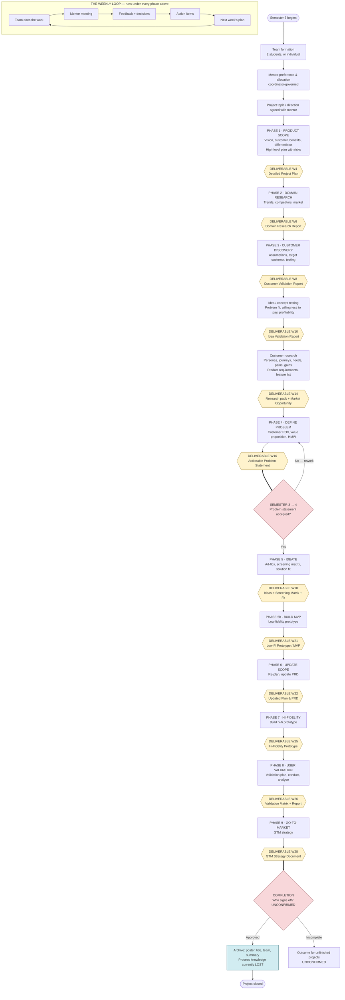

### 4.1 What this picture makes obvious

1. **The deliverables are dense in Sem 3 and sparse in Sem 4.** Six checkpoints land in weeks 4–16; six more spread over weeks 18–28. Week 10→14 is a 4-week gap carrying the single largest deliverable bundle (personas, journey maps, requirements, feature list, market opportunity). **This is where teams will silently fall behind** `[ASSUMED — test in student interviews]`.
2. **The weekly loop is invisible to the programme.** Everything between checkpoints — meetings, feedback, decisions, action items — is unrecorded at programme level. A coordinator only learns a project is in trouble at a checkpoint, by which point 2–4 weeks have been lost.
3. **Two gates are undefined.** Neither "problem statement accepted" nor "project complete" has a documented owner, criterion or record. `[KNOWN gap — proposal §9.8]`
4. **The arrow into the archive is thin.** Everything the team learned — why an idea was killed, which customer segment failed, what the screening matrix said — dies at completion. Only the poster survives. `[KNOWN — proposal §10]`

---

## 5. Stakeholder workflows

Each workflow below is drawn twice in spirit: what happens **today** (as-is, with friction marked `⚠F#`) and what the application would make happen (to-be). Friction IDs are defined in §7.

### 5.1 Student / project team — the weekly cycle

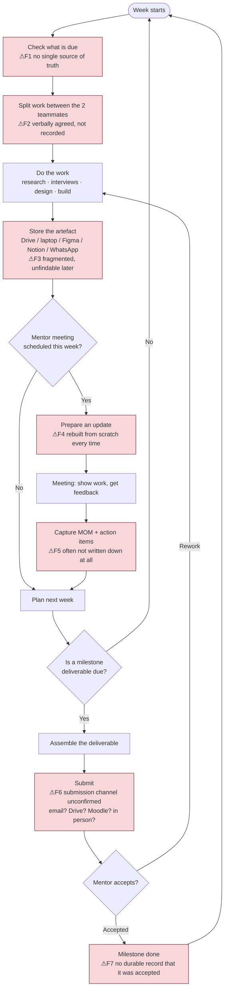

**To-be, in one line:** the student opens one page that says *what is due, what my mentor last said, what I owe them, and where every artefact lives* — and submitting is one action that simultaneously notifies the mentor, timestamps the record and updates the coordinator's dashboard.

### 5.2 Faculty mentor — the review cycle across 6–8 teams

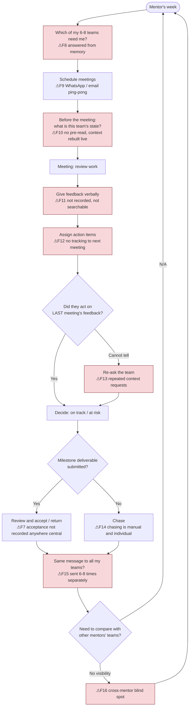

**To-be, in one line:** the mentor opens one board showing all their teams as rows against the milestone calendar, with a "needs me" column, a per-team pre-read, an open-action-items count, and a single compose box that reaches all their teams at once.

### 5.3 Programme coordinator — batch governance

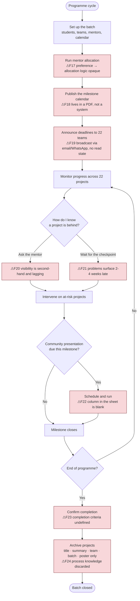

**To-be, in one line:** the coordinator opens a 22 × 12 grid — every project against every checkpoint — colour-coded by state, sortable by risk, with drill-down to any project's evidence and a one-click batch announcement.

### 5.4 The three roles side by side — a milestone in swimlanes

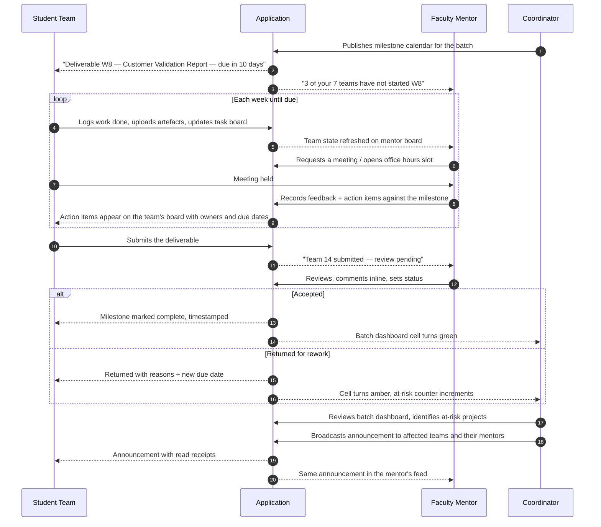

### 5.5 Alumni / future batch — the continuity workflow

```mermaid
flowchart LR
    subgraph TODAY["AS-IS — what survives today"]
        T1["Project finishes"] --> T2["Poster + title + summary<br/>+ team + batch recorded"]
        T2 --> T3["Everything else disperses:<br/>personal Drives, laptops, chats"]
        T3 --> T4["Future batch finds a title<br/>and a poster image"]
        T4 --> T5["Cannot reuse the reasoning<br/>⚠F24"]
    end
    subgraph TARGET["TO-BE — what could survive"]
        N1["Project finishes"] --> N2["Full milestone trail preserved:<br/>plan · research · personas · journeys<br/>screening matrix · prototypes · validation · GTM"]
        N2 --> N3["Decision log: what we tried,<br/>what we killed and why"]
        N3 --> N4["Searchable archive by domain,<br/>method, customer segment, mentor"]
        N4 --> N5["Future batch starts from<br/>evidence, not from zero"]
    end
    T5 -.->|"the gap this project could close"| N1

    style T5 fill:#f8d7da,stroke:#721c24
    style N5 fill:#d4edda,stroke:#155724
```

> `[KNOWN]` The existing archive covers 22 projects across the Jan 2022 and July 2022 batches — Unlabelled.FM, Fytt.io, Finsocial, For I-Dx, Aurora, ScientiQuick, Flowsight, Kyou2, GreenTrace, Finease, MediSync, VR Resilience Builder, APPRAISE, ConceptCure, JobSims, Pocket Pal, Distro-Cred, Intelli-Dispute, SQUAD, Englingo, Paddy Weeder, Safe Travel India — and stores title, product/solution summary, team members, batch and poster. It is proof that projects differ enormously in domain, solution type, team size and technical depth, **which is itself a design constraint: the system must not force one process shape on all projects.**

---

## 6. Cross-cutting workflows

These are the mechanisms that run across all stakeholders. Each one is a candidate product module.

### 6.1 Mentor allocation

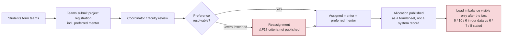

`[KNOWN]` The registration form distinguishes **preferred mentor** from **assigned mentor** — evidence that reassignment genuinely happens and that the delta is worth surfacing.

### 6.2 Meeting → minutes → action item → closure

This is the single highest-value loop in the whole system, and today it is entirely informal.

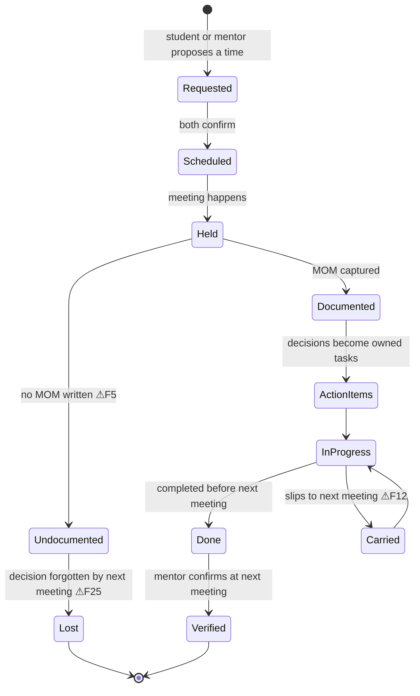

**The product insight:** a mentor's most repeated question is *"did you do what we agreed last time?"*. Any system that answers that question without the mentor asking removes the single largest recurring cost in the relationship. `[ASSUMED — this is the core hypothesis to test in mentor interviews, Week 5]`

### 6.3 Milestone submission and sign-off

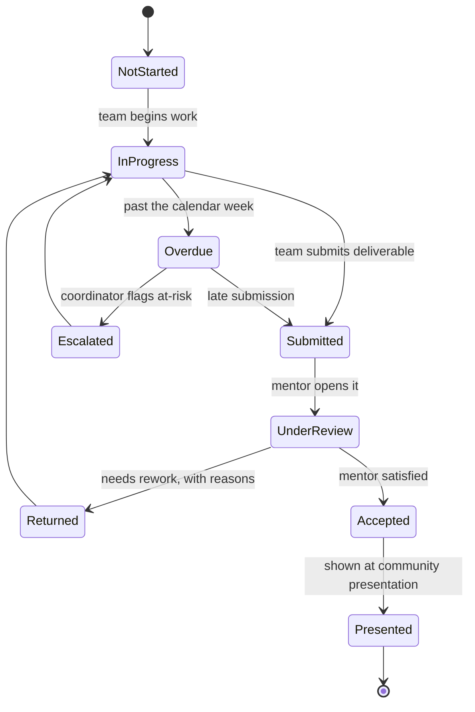

> **Design decision implied by the user's own requirement:** *"status should be updated by the faculty once they are satisfied with the team's performance."* That means **the team can move a milestone to `Submitted`, but only the mentor can move it to `Accepted`.** Students cannot self-certify. The coordinator can override — and every override is logged.

### 6.4 Communication — the broadcast problem

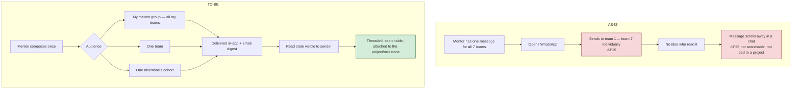

Three distinct communication needs sit under this, and they should **not** be one feature:

| Need | Shape | Who initiates | Why it is different |
|---|---|---|---|
| **Announcement** | One-to-many, no reply expected | Coordinator, mentor | Needs read receipts and permanence, not conversation |
| **Mentor group discussion** | Few-to-few, threaded | Mentor with their 6–8 teams | Cross-team learning within one mentoring line |
| **Cohort Q&A / common doubts** | Many-to-many, upvotable | Any student | The same question is asked 22 times; answer it once |
| **Private team ↔ mentor thread** | Small, confidential, project-scoped | Either | Must not leak to other teams |
| **Faculty-only channel** | Mentors + coordinator | Either | Calibration between mentors; students must not see it |

### 6.5 At-risk escalation

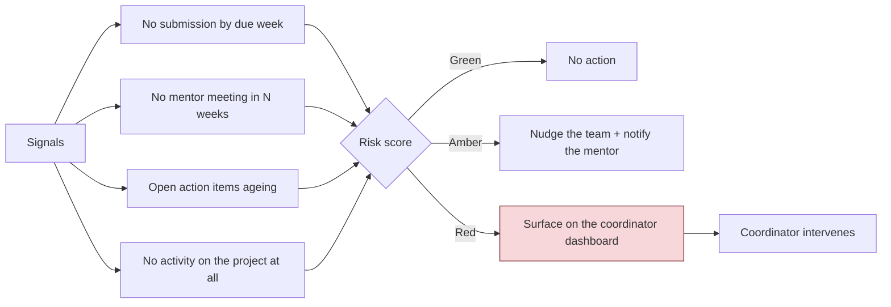

> ⚠ **Risk of the risk feature.** An automated "at-risk" flag visible to the coordinator changes the mentor–student relationship. Several mentoring platforms have had exactly this feature rejected by faculty as surveillance. **Validate the appetite for automated flagging with mentors before building it** — a flag visible only to the team and their own mentor may be the acceptable version.

### 6.6 Collaboration and ideation

The milestone sheet demands a specific set of *visual, generative* artefacts — assumption boards, personas, journey maps, HMW statements, ad-lib statements, idea screening matrices, value proposition maps. These are not documents; they are **workshop outputs**.

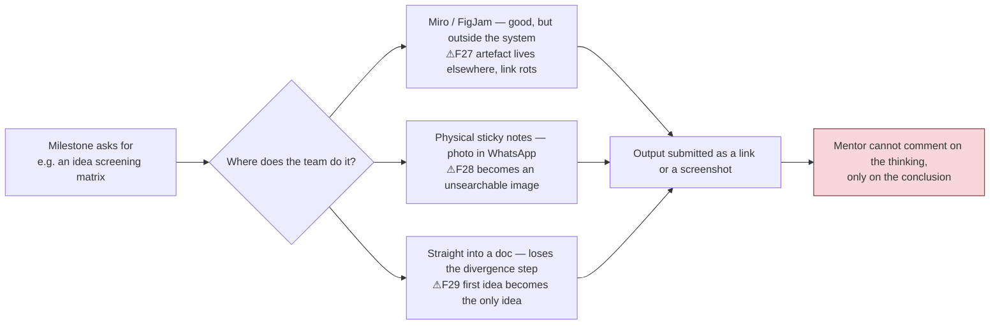

**The opportunity:** a board that ships **pre-loaded with the milestone's own template** — the W18 screening matrix, the W14 journey map, the W16 value proposition map — so the artefact is created *inside* the milestone it belongs to, and the mentor can comment on the board itself.

---

## 7. Friction register

Every friction point referenced in the diagrams, with who feels it, how costly it is, and — critically — whether we have evidence for it or merely believe it.

**Severity** = frequency × cost when it happens. **Evidence** = `[KNOWN]` / `[PARTIAL]` / `[ASSUMED]` as defined in §1.

| ID | Friction | Where in the workflow | Who feels it | Severity | Evidence | Validate with |
|---|---|---|---|---|---|---|
| **F1** | No single source of truth for "what is due next" | Student weekly loop | Student | **High** | `[PARTIAL]` — calendar exists only as a PDF | Students W3 |
| **F2** | Work split between teammates is verbal, not recorded | Student weekly loop | Student | Medium | `[ASSUMED]` | Students W3 |
| **F3** | Artefacts fragmented across Drive, laptop, Figma, chat | Storage | Student, Mentor | **High** | `[PARTIAL]` — proposal §9.7 | Students W3, Alumni W4 |
| **F4** | Status update rebuilt from scratch before every meeting | Meeting prep | Student | Medium | `[ASSUMED]` | Students W3 |
| **F5** | Minutes of meeting often not written at all | Meeting | Student, Mentor | **High** | `[PARTIAL]` — proposal §9.4 | Students W3, Mentors W5 |
| **F6** | Submission channel is undefined / varies by mentor | Submission | Student | **High** | `[ASSUMED]` | Mentors W5, Coordinator W6 |
| **F7** | Acceptance of a milestone leaves no durable record | Sign-off | All three | **High** | `[ASSUMED]` | Mentors W5, Coordinator W6 |
| **F8** | Mentor tracks which of 6–8 teams need attention from memory | Mentor week | Mentor | **High** | `[ASSUMED]` | Mentors W5 |
| **F9** | Meeting scheduling is manual chat ping-pong | Scheduling | Both | Medium | `[ASSUMED]` | Students W3, Mentors W5 |
| **F10** | No pre-read; context is rebuilt live in the meeting | Meeting | Mentor | **High** | `[PARTIAL]` — proposal §9.5 | Mentors W5 |
| **F11** | Feedback given verbally, never recorded or searchable | Meeting | Student, Mentor | **High** | `[PARTIAL]` — proposal §9.4 | Both W3/W5 |
| **F12** | Action items are not tracked from one meeting to the next | Between meetings | Both | **High** | `[PARTIAL]` — proposal §9.4 | Both W3/W5 |
| **F13** | Mentor repeatedly asks for the same context | Meeting | Mentor, Student | **High** | `[PARTIAL]` — proposal §9.5 | Mentors W5 |
| **F14** | Chasing late teams is manual, one at a time | Mentor week | Mentor | Medium | `[ASSUMED]` | Mentors W5 |
| **F15** | The same message is sent to 6–8 teams separately | Communication | Mentor | Medium | `[ASSUMED]` — named by the programme as a pain | Mentors W5 |
| **F16** | Mentors have no visibility into other mentors' projects | Cross-mentor | Mentor | Medium | `[PARTIAL]` — proposal §2 | Mentors W5 |
| **F17** | Mentor allocation criteria are opaque to students | Allocation | Student | Medium | `[PARTIAL]` — form has preferred ≠ assigned | Students W3, Coordinator W6 |
| **F18** | The milestone calendar lives in a PDF, not a system | Governance | All three | **High** | `[KNOWN]` | — already evidenced |
| **F19** | Announcements have no read state | Communication | Coordinator | Low | `[ASSUMED]` | Coordinator W6 |
| **F20** | Coordinator's view of progress is second-hand via mentors | Governance | Coordinator | **High** | `[PARTIAL]` — proposal §2, §9.6 | Coordinator W6 |
| **F21** | Problems surface 2–4 weeks late, at the next checkpoint | Governance | Coordinator, Student | **High** | `[ASSUMED]` | Coordinator W6, Mentors W5 |
| **F22** | Community presentation column is blank across all milestones | Programme design | All | Medium | `[KNOWN]` | Coordinator W6 |
| **F23** | Completion criteria are undefined | Completion | All | **High** | `[KNOWN]` — proposal §9.8 | Coordinator W6 |
| **F24** | Process knowledge is discarded at archival; only posters survive | Archival | Future batches | **High** | `[KNOWN]` — proposal §10 | Alumni W4, Coordinator W6 |
| **F25** | Decisions made in meetings are forgotten by the next one | Meeting loop | Both | **High** | `[ASSUMED]` | Both W3/W5 |
| **F26** | Chat messages are not searchable and not tied to a project | Communication | All | Medium | `[ASSUMED]` | Students W3 |
| **F27** | Ideation artefacts live in external tools; links rot | Ideation | Student, Mentor | Medium | `[ASSUMED]` | Students W3 |
| **F28** | Physical sticky-note sessions become unsearchable photos | Ideation | Student | Low | `[ASSUMED]` | Students W3 |
| **F29** | Skipping divergence: the first idea becomes the only idea | Ideation | Student | Medium | `[ASSUMED]` | Students W3, Mentors W5 |

### 7.1 The friction points ranked by what they cost the programme

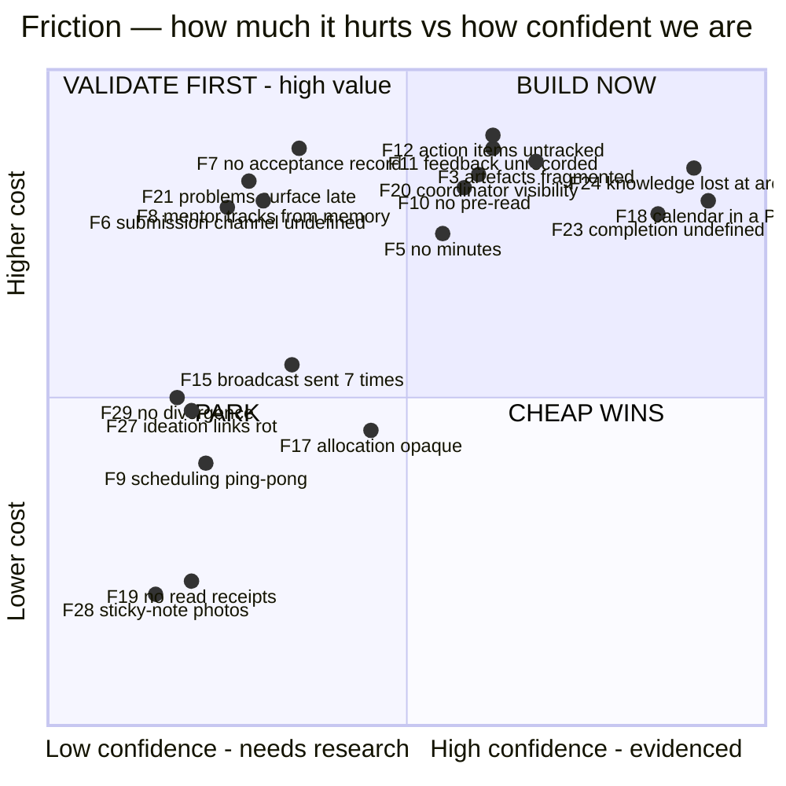

**Read this chart as the build order.** The top-right quadrant is evidenced *and* expensive — build it. The top-left is expensive *if true* — that is precisely what Weeks 3–6 interviews are for, and it is where most of the mentor-facing features sit.

---

## 8. What we know versus what we must validate

This section is the hand-off between this document and the research plan. The Assumption Register from Weeks 1–2 is reproduced and extended.

### 8.1 Validated / documented — safe to design against

| # | Statement | Source |
|---|---|---|
| K1 | The project runs 28 weeks across Sem 3 and Sem 4 with 12 dated deliverable checkpoints in 7 named phases | Milestone PDF |
| K2 | The deliverable list per phase is fixed and known (plan, domain report, validation reports, personas, journeys, feature list, problem statement, screening matrix, low-fi, hi-fi, validation report, GTM) | Milestone PDF |
| K3 | The batch has 22 teams, mostly of 2, with a small number of individual projects | Batch registration form |
| K4 | Teams state a **preferred** mentor and receive an **assigned** mentor — the two can differ | Batch registration form |
| K5 | Mentor load is uneven (6–10 teams per mentor in our data) | Batch registration form |
| K6 | A project archive exists for previous batches and stores only title, summary, team, batch and poster | Proposal §10 |
| K7 | Past projects vary enormously in domain, solution type, team size and technical depth | Proposal §10 |
| K8 | A "Community Presentation" slot exists per milestone but is unscheduled | Milestone PDF |
| K9 | Mentors are drawn from SERC, the Cognitive Science Lab and CIE, and their review practices may differ | Research plan §4 |
| K10 | Completion criteria, reviewer role and archival policy are **not** documented | Proposal §9.8, §9.9 |

### 8.2 Must be validated before building — ranked by how much design depends on the answer

| # | Open question | Blocks which feature | Ask | When |
|---|---|---|---|---|
| V1 | **Is it 7 phases, 12 checkpoints or 9 stages?** What is the canonical stage model? | The entire milestone engine | Coordinator | **W6 — blocking** |
| V2 | **How is a deliverable submitted today** — email, Drive link, Moodle, in person? | Submission module | Mentors, Coordinator | **W5/W6 — blocking** |
| V3 | **Who signs a milestone off**, and is it recorded anywhere? | Sign-off state machine | Mentors, Coordinator | **W5/W6 — blocking** |
| V4 | **Does a separate reviewer/panel role exist?** | Role model, permissions | Coordinator | **W6 — blocking** |
| V5 | Are minutes of meeting written today, by whom, and where do they go? | MOM + action-item module | Students, Mentors | W3/W5 |
| V6 | How does a mentor currently detect a team is falling behind? | Risk scoring | Mentors | W5 |
| V7 | **Do mentors want cross-project visibility, or would they resist it?** | Cross-mentor views | Mentors | W5 |
| V8 | What must stay **private** between a team and its mentor? | Permission defaults | Mentors, Students | W5 |
| V9 | Would automated at-risk flags be accepted or resented? | Escalation feature | Mentors | W5 |
| V10 | What tools do teams actually use today, and would they abandon them? | Integration vs replacement | Students | W3 |
| V11 | Is WhatsApp the real communication substrate? Can anything displace it? | Comms module | Students, Mentors | W3/W5 |
| V12 | Does the coordinator want a live dashboard, or is periodic reporting enough? | Dashboard scope | Coordinator | W6 |
| V13 | What happens to an unfinished project? | Completion states | Coordinator | W6 |
| V14 | Does anyone actually consult the archive? How often, for what? | Archive module — the whole justification | Alumni, Coordinator | W4/W6 |
| V15 | Is the community presentation real, planned or abandoned? | Presentation module | Coordinator | W6 |
| V16 | What is the authoritative mentor allocation, including Manisha? | Roster data | Coordinator | **W6 — blocking for demo credibility** |
| V17 | Would faculty use an in-app whiteboard, or will they always use Miro/FigJam? | Ideation module | Mentors, Students | W3/W5 |
| V18 | Is there an institute constraint on where student data may live? | Hosting, auth | Coordinator, IT | W6 |

> **Rule we are holding ourselves to:** a feature whose justifying assumption is still open may be *designed* and *prototyped*, but it is not promoted to Must-Have until the assumption closes. The MoSCoW table in the companion document records this per feature.

---

## 9. Product scope

### 9.1 In scope

| Area | What the application does |
|---|---|
| **Cohort & roster** | Batches, teams, students, mentors, coordinator; mentor allocation with preferred vs assigned; mentor load visible |
| **Milestone engine** | A configurable stage/deliverable calendar per batch; per-team instances of every checkpoint; states from Not Started → Accepted |
| **Deliverable submission** | Upload or link an artefact against a specific milestone; versioned; timestamped; one place per project |
| **Mentor review & sign-off** | Mentor-only status transitions, structured feedback, return-for-rework with reasons, full history |
| **Meetings, MOM & action items** | Schedule/record a meeting, capture minutes against the project, convert decisions into owned, dated action items, carry-forward tracking |
| **Team task board** | A Kanban board per project, with tasks linkable to a milestone and to an action item |
| **Communication** | Announcements with audience selection and read state; mentor-group threads; cohort Q&A; private team↔mentor thread; faculty-only channel |
| **Ideation workspace** | Milestone-templated sticky-note boards for personas, journeys, HMW, screening matrices, value proposition maps; commentable by the mentor |
| **Programme dashboard** | 22 × 12 grid of projects against checkpoints; risk surfacing; mentor load; drill-down |
| **Archive & continuity** | Completed projects preserved with their full milestone trail and decision log; searchable by domain, method, mentor, batch |
| **Notifications & digests** | Deadline reminders, submission and review notifications, weekly digest per role |
| **Audit** | Who changed what, when — especially milestone status and coordinator overrides |

### 9.2 Explicitly out of scope

| Not doing | Why |
|---|---|
| **Grading, marks, transcripts or any academic record of assessment** | The programme owns assessment; a parallel unofficial grade record is a governance risk and was never asked for |
| **Replacing institute identity/SSO with our own accounts long-term** | Auth should ride on institute identity once the project is real; our prototype uses a role switcher deliberately |
| **Replacing WhatsApp as the informal channel** | Fighting an entrenched habit will fail; we target *structured* communication that WhatsApp is bad at |
| **Video calling / conferencing** | Meet, Zoom and Teams exist; we integrate links, not build the call |
| **Real-time multi-cursor document co-editing** | Docs and Figma do this better; we hold links and metadata |
| **Full Miro/FigJam replacement** | Only the milestone-specific templates are in scope, not a general canvas product |
| **Timesheets, attendance or effort-hour policing** | Corrosive to the mentoring relationship; not asked for |
| **Plagiarism / similarity checking** | Out of the programme's stated needs |
| **Alumni networking, placements, job boards** | Adjacent but separate product |
| **External customer/interviewee portal** | Discovery participants are never system users; their data stays in the team's research notes |
| **Production-grade deployment, SLAs and support** | The fellowship scope commits to a *validated prototype and handoff*, not production software (proposal §7) |
| **Mobile native apps** | Responsive web only, for this scope |

### 9.3 The scope boundary drawn

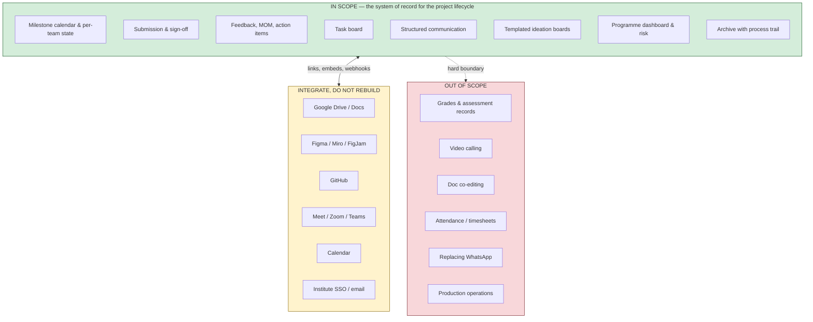

---

## 10. The data model the workflows imply

Derived from the workflows above, not from the current prototype. The prototype today models only the shaded-out part.

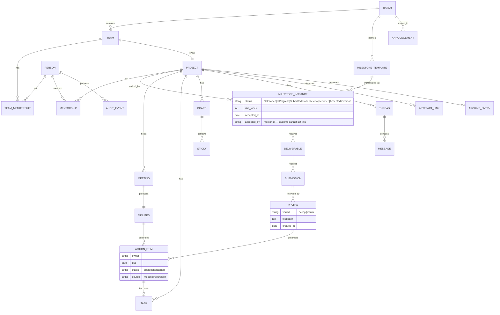

**Three structural decisions fall out of this model:**

1. **`MILESTONE_TEMPLATE` is data, not code.** Because V1 ("is it 7 or 9 stages?") is unresolved, and because K7 says projects genuinely differ, the stage model must be editable by the coordinator per batch. Hard-coding the 2026 sheet would guarantee rework.
2. **`ACTION_ITEM` has one identity across three sources** — a meeting, a review, or a team's own planning. The mentor's "did you do it?" question is answered by querying one table, not three.
3. **The current prototype has no `MILESTONE_INSTANCE` at all.** It models `Project`, `Batch`, `Person`, `Domain` and `MaterialLink` — a *directory*, not a *lifecycle*. This is the single biggest gap between what exists and what the workflows demand. See §12.

---

## 11. Measuring whether any of this works

The KPIs below are what the *programme* should get better at — not vanity metrics about the app.

| # | KPI | Definition | Baseline today | Target | Who it serves |
|---|---|---|---|---|---|
| KPI-1 | **On-time deliverable rate** | % of the 12 checkpoints submitted by their due week, per team and per batch | Unknown — not measured | Establish baseline, then +20pp | Coordinator |
| KPI-2 | **Time-to-feedback** | Median hours from submission to mentor review | Unknown | < 72h | Student |
| KPI-3 | **Action-item closure rate** | % of action items closed before the next meeting | Unknown | > 70% | Mentor |
| KPI-4 | **Meeting documentation rate** | % of mentor meetings with minutes recorded | Assumed low | > 80% | Both |
| KPI-5 | **Context-request rate** | Times a mentor asks for information the system already holds | Unknown | Trend to zero | Mentor |
| KPI-6 | **At-risk detection lead time** | Days between a project going off-track and someone noticing | 2–4 weeks assumed | < 7 days | Coordinator |
| KPI-7 | **Mentor broadcast effort** | Actions needed to reach all of a mentor's teams | 6–8 | 1 | Mentor |
| KPI-8 | **Artefact findability** | % of milestone artefacts retrievable from one place | Assumed low | 100% of submitted ones | All |
| KPI-9 | **Archive reuse** | Views/references to prior-batch projects per new batch | ~0 assumed | Establish baseline | Future batches |
| KPI-10 | **Cross-team question reuse** | Answered questions in the cohort Q&A viewed by ≥3 teams | n/a | > 40% of answered questions | Students |
| KPI-11 | **Weekly active teams** | Teams logging any activity in a given week | n/a | > 80% | Programme |
| KPI-12 | **Coordinator report assembly time** | Time to produce a batch status view | Hours, by asking | < 1 minute | Coordinator |

> KPI-1, KPI-2, KPI-3 and KPI-6 are the four that justify the product. If those do not move, the rest is decoration.

---

## 12. Where the current prototype stands against this map

The prototype in this repository (deployed, shared with the coordinator in the Weeks 3–5 update) implements a **project directory**. Measured against the workflows above:

| Workflow area | Built today | Gap |
|---|---|---|
| Roster: batches, people, projects, mentors | ✅ `Batch`, `Person`, `Project`, `Domain` in `lib/types.ts`; real 2025–2027 roster in `lib/mock-data.ts` | Manisha missing; allocation unreconciled (O-1) |
| Roles & permissions | ✅ Three roles, role switcher, `canAddProject` / `canEditProject` / `canManageRecords` in `lib/permissions.ts` | No real authentication; role is a `localStorage` key |
| Project CRUD + archive flag | ✅ Create, edit, archive, restore | — |
| Artefact links | ✅ `MaterialLink[]` on a project | Not tied to a milestone; no versions; no upload |
| Progress reporting | ✅ `/updates` page, `data/progress-updates.json` — but this reports **our own fellowship project**, not the 22 teams | Not a per-team milestone tracker |
| **Milestone engine** | ❌ nothing | **The central gap** — no stage, no due week, no state machine |
| **Submission & sign-off** | ❌ nothing | No submit action, no mentor verdict, no history |
| **Meetings / MOM / action items** | ❌ nothing | The highest-value loop is entirely unbuilt |
| **Communication** | ❌ nothing | No announcements, threads or Q&A |
| **Task board** | ❌ nothing | — |
| **Ideation boards** | ❌ nothing | — |
| **Programme dashboard** | ❌ nothing | Directory ≠ dashboard; no 22 × 12 grid, no risk |
| **Archive with process trail** | ◻ partial | `archived` boolean only; no preserved trail |
| Persistence | ❌ in-memory React state + seed data | Nothing survives a refresh; no backend |

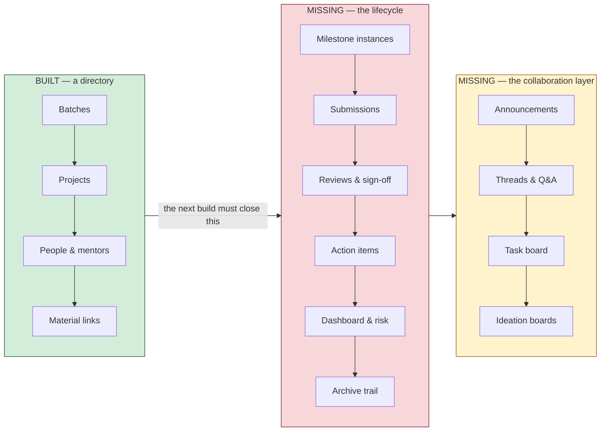

**The honest read:** what exists is a good, real, deployed *spine* — roster and identity are correct and populated with real data, which is the boring part most prototypes skip. What it is not yet is a *lifecycle* system. The first must-have build is therefore the milestone engine on top of the existing `Project` model, plus persistence, because without persistence nothing else can be demonstrated to a mentor twice.

---

## 13. Landscape scan — what already exists, and what it teaches us

We surveyed ~40 tools across six categories that overlap this problem: academic capstone/thesis supervision systems, LMS workflows, general PM tools, whiteboard/ideation tools, mentorship & accelerator platforms, and status-reporting/discovery tools. Full source list at §15.

### 13.1 The categories, and why each one only half-fits

| Category | Representative tools | What it owns | What it is blind to |
|---|---|---|---|
| **Capstone / experiential-learning platforms** | EduSourced, Practera, Riipen, CapSource, Symplicity EL | Industry-sponsored project sourcing, client relationships, automatic project repository, team matching | Built around an **external client**; our projects are student-originated. Pricing demo-gated |
| **PGR / thesis supervision systems** | SkillsForge, Creatrix, OpenEduCat, and in-house builds at Edinburgh, Exeter, Southampton, Northampton, Bournemouth | The **supervision meeting record**, progression gates, milestone dates auto-computed, automated chasing, dual digital sign-off | **One student, one thesis** — no teams, no design artefacts, no ideation, no cohort |
| **LMS** | Moodle, Canvas, Google Classroom, MS Teams | Assignments, rubrics, gradebook, group submission, competency outcomes | No mentor-portfolio view, no meeting record, no action items, no cross-team visibility. Group grading is uniform by default |
| **General PM** | Jira, Asana, Monday, ClickUp, Trello, Notion, Linear, Basecamp | Boards, tasks, dependencies, **portfolio rollups** (Asana), **cycles** (Linear), **automatic check-ins** (Basecamp) | No reviewer role, no rubric, no deliverable review. Per-seat pricing collapses at ~100 academic seats |
| **Whiteboard / ideation** | Miro, FigJam, Mural, Excalidraw, tldraw, Whimsical | Sticky notes, method templates, **facilitation primitives** (Mural: private mode, timer, voting, summon) | The board is a **URL pasted into a submission** — no versioning at the milestone boundary, no link to the criterion it evidences |
| **Mentorship / cohort** | Mentornity, Together, MentorcliQ, Mentorloop, Chronus, AcceleratorApp | Matching, **publish-once office hours → self-serve booking**, co-edited session agendas, relationship-health dashboards | Relationship-shaped, not deliverable-shaped. No milestone artefact review |
| **Status / discovery** | Geekbot, 15Five, Weekdone, Range, Basecamp, Dovetail, Condens, Maze | The **structured weekly check-in as a scheduled ritual**, named blocker fields, research repositories | Status lives in a different system from the work. Repositories only analyse data collected elsewhere |

### 13.2 Ten patterns worth stealing

Each is mapped to the friction it would remove and the feature it becomes.

| # | Pattern | Source | Removes | Becomes |
|---|---|---|---|---|
| 1 | **Pre-filled meeting record + dual time-stamped sign-off + automated chasing when a record is overdue** | SkillsForge (PGR supervision, York/KCL since 2010) | F5, F10, F25 | M6-1, M6-2, M6-8 |
| 2 | **Milestone templates with auto-computed target dates, plus automatic risk flags** — missed a milestone, exceeded expected timeline, or >30 days with no progress submission | Thesis-management systems (Creatrix, ThesisTrack) | F18, F21 | M3-1, M3-4, M10-5 |
| 3 | **Portfolio rollup as a distinct role-scoped screen** — real-time status across many projects | Asana Portfolios | F8, F20 | M10-1, M10-4 |
| 4 | **The weekly check-in as a scheduled ritual with named fields**, where *blocker* is a field, not prose — set up in under five minutes | Geekbot, 15Five, Basecamp automatic check-ins | F4, F21 | M8-5, M8-6 |
| 5 | **Dual-grade peer review with calibration examples** — grade the work *and* the quality of the review; publish exemplars before the real round | Moodle Workshop | F29 | Future peer-review module |
| 6 | **Competency outcomes aligned to rubric criteria, tracked longitudinally** — "is this team's problem-framing improving across the 12 checkpoints?" rather than "what did they score in week 7?" | Canvas Outcomes → Learning Mastery Gradebook | F11 | M5-8 |
| 7 | **Co-edited session agenda with action items that carry forward and pre-populate the next agenda** | Together Platform | F12, F13, F25 | M6-3, M6-4, M6-8 |
| 8 | **Publish-once office hours → self-serve booking → calendar sync** | Mentornity | F9 | M6-7 |
| 9 | **The archive as an automatic by-product, not a final task**, plus a cross-cohort living knowledge base | EduSourced; YC Bookface; UChicago DSI "Best in Show" | F24 | M11-2, M11-3 |
| 10 | **Facilitation primitives in the canvas: private mode, timer, voting, summon** — private mode (silent independent ideation before reveal) is the one that most changes affinity-mapping quality | Mural (keeps timers and voting on the free tier; Miro paywalls both) | F29 | M9-2, M9-7, M9-8 |

### 13.3 Ten friction points these tools share — things not to repeat

| # | Friction in the market | Evidence | Our design response |
|---|---|---|---|
| 1 | **Per-seat pricing breaks at cohort scale.** ~100 seats × $9–25/user/mo = $10k–30k/yr for one course. Monday has a 3-seat minimum then sells in blocks of 5; Trello Free caps at 10 collaborators per workspace; Jira Free at 10 users; Asana Personal at 2 | Vendor pricing pages | Build, or use flat-rate/education-tier tools. Cost is a first-class constraint |
| 2 | **Onboarding cost exceeds the deployment's useful life.** ClickUp needs 1–4 weeks of structured onboarding; Jira needs 2–4h of admin config before anyone is productive | Capterra, vendor guides | **The cohort turns over annually — we re-pay onboarding every year.** Zero-config defaults are mandatory |
| 3 | **History evaporates.** Slack Free hides messages past 90 days and permanently deletes beyond a year; Jamboard was retired 31 Dec 2024 and auto-converted every board to a PDF | Slack docs; Google Workspace Updates | Never build the archive on a vendor's free tier. Keep the canvas replaceable behind an interface |
| 4 | **Group grading is uniform by default** — Moodle gives every member the same grade without a third-party plugin | Moodle docs, NCSU guide | Not our problem (assessment is out of scope), but it explains why the LMS is not the answer here |
| 5 | **Rubrics are shared where they should be role-scoped** — in Canvas the same rubric serves instructor and peer review, so no instructor-only rubric is practical | UCSD guide, Canvas idea 4789 | Mentor-visible and student-visible feedback must be separable fields from day one |
| 6 | **Gradebooks are the most-hated surface in every LMS** — undoable overrides, CSV import silently overwriting locked grades, headers lost on scroll | Cubite analyses, Capterra | Any destructive action needs confirmation and an audit trail (M1-9) |
| 7 | **Canvases degrade with content and time.** Miro lag is flagged in 773 G2 reviews; Miro's own guidance is <5,000 objects per board | G2, Miro KB | A year-long project generates exactly that. Board-per-milestone, not board-per-project |
| 8 | **Status lives in a different system from the work.** Geekbot's Jira integration is read-only — you cannot update the ticket from inside the standup | Geekbot docs | The check-in must write to the same objects the milestone reads |
| 9 | **Notification streams compete rather than aggregate.** 65% of professionals report mental drain from multi-channel management; each tool assumes it deserves an immediate response | LumApps, Meister | **Aggregate into a digest; do not become a fourth notification stream** (M12-6) |
| 10 | **Pricing is demo-gated across the whole academic and mentoring category** — EduSourced, Practera, PebblePad, SkillsForge, Symplicity, Chronus, Together, MentorcliQ all hide pricing behind a sales call | Category survey | Procurement friction alone justifies an in-house build for a 22-team programme |

### 13.4 What nothing in the market does — the actual opportunity

This is the section that answers *"why build anything at all?"*

1. **Nothing unifies the stage-gate lifecycle with the mentor conversation.** PGR systems own the meeting record but know nothing about teams, design artefacts or ideation. PM tools own tasks but have no reviewer, rubric or gate. Mentoring platforms own the relationship but not the deliverable. **The checkpoint, the deliverable, the review, the feedback and the action item are one causal chain — and no product models that chain end to end.**
2. **Nothing gives a mentor a cross-team comparative view.** Every LMS is course-shaped (one instructor, N students); every PM tool is project-shaped. A mentor holding 6–8 teams needs one screen answering *"which of my teams are behind on Customer Discovery, and which action items from last week are still open?"* Asana Portfolios is the nearest miss and is neither role-scoped nor deliverable-aware. **The coordinator's 22-team version exists nowhere.**
3. **Action items from reviews go nowhere.** Several tools store them; none closes the loop — assign out of a review, carry onto the next agenda pre-populated, close against evidence in the next deliverable, roll open counts into a health signal. The supervision literature names this precisely: *"potentially productive discussions dissolve into confusion because neither party has a clear record of what was decided or why."*
4. **Ideation artefacts are orphaned from assessment.** The How-Might-We, the affinity map and the value-proposition canvas live in Miro/FigJam and reach the programme as a pasted URL — no snapshot at the milestone boundary, no link to the criterion they evidence, no guarantee they survive. **Nothing treats a canvas as a first-class, snapshot-able, reviewable deliverable.**
5. **The archive is always a manual afterthought.** University capstone archives are static pages assembled by hand — to the point that the University of Washington iSchool ran a capstone project *about* fixing its own capstone archive. **Nobody generates a searchable cross-cohort archive as the automatic residue of the year's work.**
6. **Community presentations have no software home at all.** Demo days, cohort crits, structured audience feedback — absent from every tool surveyed except as an event page. **Our milestone sheet has a blank column waiting for exactly this** (F22).
7. **Nothing is priced for ~100 academic seats for two semesters.** The realistic alternatives are: build it, or assemble four tools that do not talk to each other.

### 13.5 Evidence that building it works

A purpose-built Final-Year-Project management system covering proposal processing, project assignment, completion and evaluation — with **personalised workspaces per role (student / advisor / admin)** — scored **98% on coordination and 96% on communication**, with **90% of advisors and 92.8% of students** positively inclined to use it. Separately, capstone teams are documented as preferring **web-based cloud document-sharing and task-progress tools over desktop PM software**.

That is the closest empirical evidence available that this project is worth doing — and it points at the same architecture this document arrives at independently: **role-scoped workspaces over a shared milestone spine.**

### 13.6 Build-versus-buy, per module

| Module | Verdict | Reason |
|---|---|---|
| Milestone engine, submission, sign-off, dashboard | **Build** | Nothing in the market models the chain; it is the differentiator |
| Meetings, MOM, action items | **Build**, borrowing SkillsForge's record + sign-off + chase model | Same reason; and the PGR tools that do it are single-student and institutionally licensed |
| Ideation canvas | **Integrate first, build later** | Embed Miro/FigJam (M9-6) short-term. If built: **Excalidraw is MIT-licensed, embeddable as a React component and self-hostable with real-time collaboration** — the only option without a per-seat bill. tldraw's SDK is more product-grade but its startup licence is listed at **$6,000/year**, which is disqualifying here. Note Excalidraw's default end-to-end encryption means board content cannot be server-side indexed — a real constraint on archive search |
| Communication | **Build the structured half; integrate the informal half** | Announcements, mentor groups and Q&A are ours. Do not try to displace WhatsApp; mirror to email (M7-11) |
| Video calls, documents, design files | **Integrate, never build** | Meet, Drive and Figma win outright |
| Auth | **Integrate** | Institute identity once real (M1-4) |

---

## 14. IIIT Hyderabad ecosystem scan — what is publicly documented

We searched the institute's own web estate (`iiit.ac.in`, `pdm.iiit.ac.in`, `serc.iiit.ac.in`, `courses.iiit.ac.in`) and the open web for evidence about how the PDM final project actually runs. The result is as informative for what is **absent** as for what is present.

### 14.1 Verified from institute sources

| # | Finding | Source |
|---|---|---|
| E1 | The programme is the **M.Tech in Product Design and Management**, structured as *"2 Semesters of Classes + 2 Semesters of Product Development Project"*, 66 credits total, minimum CGPA 6.0 to graduate | [pdm.iiit.ac.in](https://pdm.iiit.ac.in/), [Academics](https://pdm.iiit.ac.in/academics/) |
| E2 | For the **Monsoon 2025 → Spring 2027 curriculum — this batch** — the capstone is **Final Project, course codes PD9.403 and PD9.404, 24 credits**. Eligibility: *"Students must complete minimum of 28 credits to become eligible for the Final Project"* | [Academics](https://pdm.iiit.ac.in/academics/) |
| E3 | The **Monsoon 2026 → Spring 2028 curriculum changes this materially**: Product Development Project Part 1 (6 cr) + optional Part 2 (6 cr), with an **Industry Internship (6 cr) as an alternative**; eligibility rises to 28 credits **and CGPA ≥ 7.0**; and *"Only those students who ha[ve] received a minimum of 'C' grade in PDM Final Project Part 1 are eligible to register for PDM Final Project Part 2"* | [Academics](https://pdm.iiit.ac.in/academics/) |
| E4 | A mandatory **0-credit Industry/Institute Seminar** must be passed to remain eligible for capstone work | [Academics](https://pdm.iiit.ac.in/academics/) |
| E5 | **Dr. Raman Saxena is listed as "Professor & Program Coordinator"** — i.e. the programme coordinator is also one of the mentoring faculty | [About](https://pdm.iiit.ac.in/about/), [SERC profile](https://serc.iiit.ac.in/people/raman/) |
| E6 | Core faculty listed publicly: **Dr. Raman Saxena** (Professor & Program Coordinator), **Dr. Raghu Babu Reddy Y** (Associate Professor), **Prakash Yalla** (Professor of Practice), **Ramesh Loganathan** (Professor of Practice, Co-innovations), Karthik Vaidhyanathan (Assistant Professor, SERC), Priyanka Srivastava (Associate Professor) | [About](https://pdm.iiit.ac.in/about/) |
| E7 | The programme is run jointly by **SERC, the Cognitive Science Lab and CIE** | [iiit.ac.in programme page](https://www.iiit.ac.in/m-tech-in-product-design-and-management/) |
| E8 | **The archive is real and public**: [pdm.iiit.ac.in/graduation-projects](https://pdm.iiit.ac.in/graduation-projects/) shows **Jan 2022 (7 projects) and July 2022 (15 projects) = 22 projects** in batch tabs. Fields recorded per project: **title · product/solution summary · student names · poster thumbnail.** Nothing else | [Graduation Projects](https://pdm.iiit.ac.in/graduation-projects/) |
| E9 | The archive has **no search, no filters beyond the two batch tabs, and no linked process artefacts** — no reports, no research, no prototypes, no decision logs | [Graduation Projects](https://pdm.iiit.ac.in/graduation-projects/) |
| E10 | The institute LMS is **Moodle at `courses.iiit.ac.in`**, organised by semester | [courses.iiit.ac.in](https://courses.iiit.ac.in/) |
| E11 | The programme coordinator is reachable at **`pdm_coordinator@research.iiit.ac.in`**, described as *"Program Coordinator/Mentor"* | [Academics](https://pdm.iiit.ac.in/academics/) |
| E12 | Course Projects are showcased separately from graduation projects, as **poster images grouped by course and semester**, mostly without team names or descriptions | [Course Projects](https://pdm.iiit.ac.in/course-projects/) |

### 14.2 What is conspicuously NOT documented anywhere public

This is the important half. After a thorough search, **none** of the following exists on the open web:

| Absent | Consequence |
|---|---|
| Mentor allocation process or criteria | V17 cannot be answered from documents — it must be interviewed |
| How a deliverable is submitted (Moodle? Drive? email? in person?) | **V2 stays fully open.** Moodle exists institute-wide but nothing ties the PDM final project to it |
| Review cadence, panels, or who signs off a milestone | V3, V4 stay fully open |
| Completion criteria, or what happens to an unfinished project | V3, V13 stay fully open |
| The milestone sheet itself | Our PDF is an internal artefact, not published — so the calendar genuinely lives only in a document (**F18 confirmed**) |
| Any community-presentation or demo-day event for final projects | **F22 confirmed** — the blank column is blank everywhere, not just in our copy |
| Any mentor named **Manisha** in a faculty or coordinator role | **O-1 stands.** Manisha may be guest faculty, an industry mentor or a staff coordinator — but is not publicly listed. Must be confirmed with the coordinator |

> **The absence is the finding.** For a programme that has run since at least 2021 and produced 22 archived projects, the entire operational process — allocation, submission, review, sign-off, completion — exists only in people's heads, email and a PDF. That is precisely the gap this project addresses, and we can now say so with evidence rather than assumption.

### 14.3 Three things this changes in our design

1. **⚠ The coordinator is also a mentor (E5).** Our role model assumed three disjoint roles. If Dr. Raman Saxena is both the programme coordinator *and* mentors ~7–10 teams, then:
   - A single person must be able to hold **both** roles and switch context, not pick one at login.
   - "Coordinator sees everything, mentor sees only their teams" becomes a **view filter**, not an account type.
   - The privacy question (V8) sharpens considerably: if the coordinator is a peer mentor, "visible to the coordinator" is not a neutral statement to the other three mentors.
   - **This is now the highest-priority correction to the permission model, and it is evidenced, not assumed.**
2. **The curriculum changes between batches (E2 vs E3).** 24 credits as one Final Project for 2025–27; 6 + 6 credits with an internship alternative and a grade gate for 2026–28. **A hard-coded milestone model would be obsolete for the next cohort.** This converts M3-1 (configurable templates per batch) from a design preference into a requirement, and strengthens the case for M3-11 (alternative tracks).
3. **The archive's exact schema is now known (E8, E9).** Our archive module should reach *parity* with title + summary + students + poster on day one — that is the bar it must not fall below — and its entire differentiation is everything E9 says is missing: the process trail, the decision log, and search.

### 14.4 Benchmark note

The public archive convention across comparable programmes (University of Chicago DSI, UW iSchool, UW HCDE) is the same shape: a static gallery with posters, assembled by hand after the fact. UW iSchool went as far as running a capstone project titled *"Reimagining iSchool Capstone Archive"*. IIITH PDM's page is neither better nor worse than the norm — **the norm is the problem**.

---

## 15. Sources

### Institute and programme
- M.Tech in Product Design and Management — https://www.iiit.ac.in/m-tech-in-product-design-and-management/
- PDM programme site — https://pdm.iiit.ac.in/
- PDM Academics / curriculum — https://pdm.iiit.ac.in/academics/
- PDM About / faculty — https://pdm.iiit.ac.in/about/
- PDM Graduation Projects archive — https://pdm.iiit.ac.in/graduation-projects/
- PDM Course Projects — https://pdm.iiit.ac.in/course-projects/
- SERC profile, Raman Saxena — https://serc.iiit.ac.in/people/raman/
- IIITH faculty, Raman Saxena — https://www.iiit.ac.in/faculty/raman-saxena/
- IIITH Moodle — https://courses.iiit.ac.in/

### Internal artefacts (not public)
- *PDM Project — Milestones · Activities · Deliverable · Suggested Timelines (2026)* — the milestone PDF
- *Proposal: Digitizing the PDM Final Project Lifecycle* — §§2, 7–10
- *Research Plan & Participant List* — Weeks 3–6 discussion guides and assumption register
- PDM 2025–2027 batch project registration form — roster, teams, preferred vs assigned mentor

### Landscape scan — academic capstone, thesis and supervision systems
- EduSourced — https://www.edusourced.com/product/ · Practera — https://practera.com/ · Riipen — https://www.riipen.com/ · CapSource pricing — https://capsource.io/company-pricing/
- Symplicity Experiential Learning — https://www.symplicity.com/experiential-learning · PebblePad — https://pebblepad.com/platform/
- SkillsForge PGR functionality — https://skillsforge.com/overview/pgr-management-system-functionality/
- Creatrix thesis management — https://www.creatrixcampus.com/thesis-management-system · ThesisTrack roundup — https://www.thesistrack.io/blog/best-thesis-management-software
- Edinburgh PGR supervision — https://registryservices.ed.ac.uk/student-systems/support-guidance/academic-staff/pgr-supervision · Bournemouth ProGRess — https://www.researchgate.net/publication/398612371
- FYP management system study — https://www.researchgate.net/publication/283757588_The_Development_of_a_Final_Year_Project_Management_System_for_Information_Technology_Programmes
- Feedback in capstone, systematic review — https://www.frontiersin.org/journals/education/articles/10.3389/feduc.2025.1657737/full
- UChicago DSI capstone archive — https://datascience.uchicago.edu/education/masters-programs/ms-in-applied-data-science/capstone-project-archive/ · UW iSchool capstone — https://ischool.uw.edu/capstone

### Landscape scan — LMS
- Moodle Rubrics — https://docs.moodle.org/502/en/Rubrics · Moodle Workshop — https://docs.moodle.org/en/Workshop_activity · Moodle limitations — https://cubite.io/blogs/moodle-limitations
- Canvas Outcomes + Learning Mastery Gradebook — https://teaching.pitt.edu/resources/track-student-progress-with-outcomes-and-the-learning-mastery-gradebook/ · Canvas peer review — https://extensionhelpcenter.ucsd.edu/hc/en-us/articles/45303673169165-Using-Peer-Review-in-Canvas-LMS-Embracing-and-Leveraging-Existing-Features
- Google Classroom limits — https://support.google.com/edu/classroom/answer/7300976 · MS Teams Assignments — https://learn.microsoft.com/en-us/MicrosoftTeams/expand-teams-across-your-org/assignments-in-teams

### Landscape scan — PM, ideation, mentoring, status
- Asana pricing/portfolios — https://www.g2.com/products/asana/pricing · Jira editions — https://www.atlassian.com/software/jira/guides/more/jira-editions · Trello workspace limits — https://support.atlassian.com/trello/docs/workspace-user-limit/ · Monday pricing — https://plaky.com/learn/plaky/monday-com-pricing/ · Notion for education — https://www.notion.com/help/notion-for-education · Basecamp pricing — https://www.proofhub.com/articles/basecamp-pricing
- Miro pricing — https://miro.com/pricing/ · Miro board performance — https://help.miro.com/hc/en-us/articles/360013588560-Board-performance-and-loading-issues · Miro Live Embed — https://developers.miro.com/docs/miro-live-embed-introduction
- Mural pricing — https://www.g2.com/products/mural/pricing · FigJam pricing — https://www.capterra.com/p/265222/FigJam/pricing/
- Jamboard retirement — https://workspaceupdates.googleblog.com/2023/09/the-next-phase-of-digital-whiteboarding-for-google-workspace.html
- Excalidraw self-hosting — https://plus.excalidraw.com/docs/self-hosting/excalidraw-open-source-selfhosting · tldraw pricing — https://tldraw.dev/pricing
- Mentornity pricing — https://www.mentornity.com/pricing/ · Together Platform agendas — https://www.togetherplatform.com/blog/mentor-meeting-agendas-for-productive-sessions-template · Mentorloop G2 — https://www.g2.com/products/mentorloop-mentoring-software/reviews
- Geekbot — https://geekbot.com/pricing/ · 15Five — https://www.g2.com/products/15five/pricing · Dovetail pricing — https://formbricks.com/blog/dovetail-pricing
- Slack free-plan history limits — https://pebb.io/blog/slack-s-90-day-message-history-restriction-what-you-can-do-about-it · Notification fatigue — https://www.meistertask.com/blog/notification-fatigue-the-productivity-killer-explained · WhatsApp in education — https://files.eric.ed.gov/fulltext/EJ1234817.pdf

---

## 16. What happens next

1. **Correct the role model for the coordinator-is-also-a-mentor finding (E5)** — before any permission code is written.
2. **Build the milestone engine (M3-1 … M3-6)** this week, as configurable data.
3. **Take V1, V2, V3, V4 and V16 to the coordinator in the Week 6 session.** Five questions, all blocking, one meeting.
4. **Re-run this document's friction register against the Week 3–6 interview findings** and reissue as v2.0, moving items out of `[ASSUMED]` in both directions.

> This document is deliberately falsifiable. If the Week 3–6 interviews show that mentors already keep disciplined minutes, that submissions already flow cleanly through Moodle, and that nobody wants the archive — then most of §7 is wrong and the product shrinks to a dashboard. **That outcome would be a successful research phase, not a failed one.**
