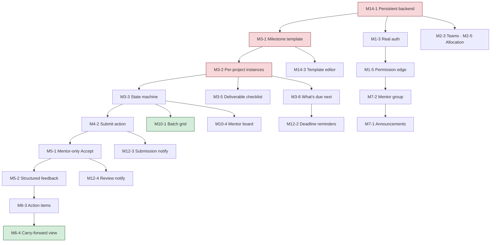

# PDM Project Space — Feature Catalogue & MoSCoW Prioritisation

**Project:** Digitization of the PDM Final Project Lifecycle
**Companion to:** [`01-workflow-map.md`](./01-workflow-map.md) — read that first; every feature here traces to a friction point (`F#`) defined there.
**Document owner:** Sri Peri Charan
**Version:** 1.0 · 12 September 2026 (Week 5)

---

## 1. Insights from the workflow map

Nine findings from the workflow mapping drive everything in this catalogue. They are stated first so that the priorities below can be argued with, not just accepted.

### Insight 1 — The programme has a calendar but no clock
Twelve dated checkpoints exist in a PDF (`[KNOWN]`). Nothing in any system knows today's date against that calendar. Every "are we behind?" question — for a student, a mentor or the coordinator — is answered by a human reading a PDF and doing arithmetic. **A milestone engine is not a feature; it is the missing substrate.** Everything else attaches to it.

### Insight 2 — The expensive loop is weekly, but the visible loop is every 4 weeks
Deliverables land at weeks 4, 6, 8, 10, 14, 16, 18, 21, 22, 25, 26, 28. Between them, the real work happens in an invisible weekly loop of meet → feedback → act. The programme only sees the checkpoints. **Problems therefore surface one checkpoint late** — 2 to 4 weeks of a 28-week project, which is 7–14% of the entire timeline lost per incident (F21).

### Insight 3 — "Did you do what we agreed?" is the most expensive recurring question
It is asked by four mentors, of 6–8 teams each, roughly weekly, for 28 weeks — on the order of **700+ askings per batch**. Each one costs meeting minutes and produces no record. Answering it without asking is the highest-leverage single change in the system (F12, F13, F25).

### Insight 4 — One message, sent seven times
A mentor with 7 teams who wants to say one thing performs the same action 7 times, with no read state and no archive (F15). The fix is trivial to build and the time saved is immediate and obvious to the person who has to approve the project. **This is the cheapest credible win available.**

### Insight 5 — The archive keeps the poster and throws away the reasoning
22 previous projects are preserved as title, summary, team, batch and poster (`[KNOWN]`). Everything that made them educational — the assumptions that failed, the segment that did not convert, the idea killed by the screening matrix — is gone (F24). A programme whose entire pedagogy is *process* is archiving only *outcomes*.

### Insight 6 — The milestone sheet demands workshop artefacts, and there is nowhere to hold a workshop
Personas, journey maps, HMW statements, ad-lib statements, screening matrices, value proposition maps. These are generative, visual, divergent artefacts. Today they are made in Miro/FigJam (outside the system), on physical stickies (photographed into chat) or skipped straight to a conclusion (F27–F29). **Templating them per milestone is a differentiator no general PM tool offers.**

### Insight 7 — Two gates in the process have no owner
"Problem statement accepted" (week 16, the semester boundary) and "project complete" (week 28) are both undefined in the documents we hold (F23, `[KNOWN]` gap). A system that forces a decision to be recorded at these two points creates governance that does not currently exist — which is valuable, and also the most politically sensitive thing in this catalogue. **Design it as *recording* a decision the humans already make, never as the system making it.**

### Insight 8 — Cross-visibility is an opportunity and a landmine
Mentors likely cannot see each other's projects (F16). Whether they *want* to is genuinely unknown (V7), and the proposal explicitly flags privacy as an open question (V8). Build the data model so visibility is a setting; do not ship a default that assumes openness.

### Insight 9 — The prototype is a directory; the programme needs a lifecycle
Everything currently built models *who and what*. Nothing models *when, how far, and what next*. The first sprint has to change the shape of the data, not add screens to the current shape.

### Insight 10 — The coordinator is also a mentor, and the curriculum changes between batches
Two facts came out of the institute's own published pages, not from our assumptions. **First:** the programme coordinator is publicly listed as *"Professor & Program Coordinator"* and is simultaneously one of the mentoring faculty — so "role" must be a view filter a person switches between, not an account type they are assigned (M1-11). **Second:** the 2025–27 curriculum runs the capstone as a single 24-credit Final Project (PD9.403/404), while the 2026–28 curriculum splits it into Part 1 + optional Part 2 with an internship alternative and a grade gate. **Any hard-coded stage model is obsolete for the next cohort before it ships** (M3-1, M3-11).

---

## 2. How this catalogue is organised

### 2.1 Priority definitions

| Priority | Meaning | Test it must pass |
|---|---|---|
| 🔴 **MUST** | The product is not usable or not credible without it, in this academic year | If we removed it, would a mentor or coordinator stop using the tool entirely? |
| 🟠 **SHOULD** | Materially improves the core loop; painful to omit but survivable | Would a user work around it with a minor annoyance? |
| 🟡 **COULD** | Real value, clearly lower urgency; build if capacity allows | Would anyone notice its absence in week one? |
| 🟣 **DELIGHTER** | Not asked for, disproportionately memorable when present | Would a user show it to someone else unprompted? |
| ⚪ **WON'T (this scope)** | Deliberately excluded — see workflow map §9.2 | Is it someone else's product, or a governance risk? |

### 2.2 Every feature carries

| Field | Meaning |
|---|---|
| **ID** | `M<module>-<n>` — stable reference for the backlog |
| **Friction** | The `F#` from the workflow map it removes |
| **Evidence** | `[KNOWN]` / `[PARTIAL]` / `[ASSUMED]` — the state of the justifying belief |
| **Validate** | Which open question (`V#`) must close before this is safely a Must |
| **Effort** | S ≈ ≤½ day · M ≈ 1–2 days · L ≈ 3–5 days · XL ≈ >1 week, at this team's 5h/week/person |
| **Priority** | MoSCoW as above |

> **Governing rule.** A feature is only 🔴 MUST if either (a) its evidence is `[KNOWN]`/`[PARTIAL]`, or (b) it is structural — the system cannot be built later without it. Features resting on `[ASSUMED]` evidence are capped at 🟠 SHOULD until the interview that validates them is done. This is the discipline the proposal (§7) commits us to.

---

## 3. The feature catalogue

### M1 — Identity, roles and access

| ID | Feature | Description | Friction | Evidence | Validate | Effort | Priority |
|---|---|---|---|---|---|---|---|
| M1-1 | Three core roles | Student, Faculty Mentor, Programme Coordinator as first-class roles | — | `[KNOWN]` | — | S | 🔴 MUST *(built)* |
| M1-2 | Role-based route & action guards | Every mutation checked against role + relationship, not just hidden in the UI | — | `[KNOWN]` | — | M | 🔴 MUST |
| M1-3 | Real authentication | Email/password or magic link, replacing the demo role switcher | — | `[KNOWN]` | V18 | M | 🔴 MUST |
| M1-4 | Institute SSO / Google Workspace login | Sign in with the IIITH account | — | `[ASSUMED]` | V18 | L | 🟠 SHOULD |
| M1-5 | Mentor↔team relationship as a permission edge | A mentor's rights derive from allocation, not a global "mentor" flag | F16, F8 | `[KNOWN]` | V8 | M | 🔴 MUST |
| M1-6 | Per-project visibility setting | Team/mentor-private vs mentor-group vs batch-visible | F16 | `[ASSUMED]` | V7, V8 | M | 🟠 SHOULD |
| M1-7 | Reviewer / panel role | Fourth role with review-only access at defined gates | — | `[ASSUMED]` | **V4 blocking** | M | 🟡 COULD |
| M1-8 | Coordinator impersonation / "view as" | See exactly what a student or mentor sees, for support | — | `[ASSUMED]` | — | M | 🟡 COULD |
| M1-9 | Audit log of privileged actions | Every status override, role change and deletion recorded with actor and time | F7 | `[ASSUMED]` | V3 | M | 🟠 SHOULD |
| M1-10 | Account deactivation on graduation | Alumni lose write access, keep read access to their own project | — | `[ASSUMED]` | V13 | S | 🟡 COULD |
| M1-11 | **One person can hold both mentor and coordinator roles** | Role is a view filter, not an account type — the programme coordinator is also a mentoring faculty member | F16 | `[KNOWN]` — [PDM About page](https://pdm.iiit.ac.in/about/) lists Dr. Raman Saxena as *Professor & Program Coordinator* | V8 | M | 🔴 **MUST — corrects an existing wrong assumption** |

### M2 — Cohort, teams and allocation

| ID | Feature | Description | Friction | Evidence | Validate | Effort | Priority |
|---|---|---|---|---|---|---|---|
| M2-1 | Batch management | Create/edit batches with admission & graduation years | — | `[KNOWN]` | — | S | 🔴 MUST *(built)* |
| M2-2 | Student & mentor directory | People with roll numbers, roles, contact | — | `[KNOWN]` | — | S | 🔴 MUST *(built)* |
| M2-3 | Team formation | Teams of 1–3 with a stated lead | F2 | `[KNOWN]` | — | M | 🔴 MUST |
| M2-4 | Project record per team | Title, description, problem, outcome, domain, status | — | `[KNOWN]` | — | M | 🔴 MUST *(built)* |
| M2-5 | Mentor allocation with preferred vs assigned | Record both; show where they differ | F17 | `[KNOWN]` | V16 | M | 🔴 MUST |
| M2-6 | Mentor load view | Teams per mentor, visible to the coordinator during allocation | F17 | `[KNOWN]` | V16 | S | 🟠 SHOULD |
| M2-7 | Co-mentor support | Two mentors on one project, both with mentor rights | — | `[PARTIAL]` — Raghu + Ramesh | V16 | S | 🟠 SHOULD |
| M2-8 | Bulk roster import from CSV / the registration form | Load 40+ students and 22 teams in one action | — | `[KNOWN]` | — | M | 🟠 SHOULD |
| M2-9 | Preference-collection round | Students submit ranked mentor preferences in-app | F17 | `[ASSUMED]` | V16 | L | 🟡 COULD |
| M2-10 | Allocation assistant | Suggest an allocation balancing load against preferences | F17 | `[ASSUMED]` | V16 | XL | 🟣 DELIGHTER |
| M2-11 | Domain / theme tagging | Tag projects by domain for filtering and archive search | — | `[KNOWN]` | — | S | 🟠 SHOULD *(built)* |

### M3 — Milestone engine *(the spine)*

| ID | Feature | Description | Friction | Evidence | Validate | Effort | Priority |
|---|---|---|---|---|---|---|---|
| M3-1 | **Milestone template per batch** | The 7 phases / 12 checkpoints as editable data, with due weeks | F18 | `[KNOWN]` | V1 | L | 🔴 **MUST — build first** |
| M3-2 | **Per-project milestone instances** | Every team gets all 12 checkpoints, individually stateful | F1, F18 | `[KNOWN]` | V1 | L | 🔴 **MUST** |
| M3-3 | **Milestone state machine** | NotStarted → InProgress → Submitted → UnderReview → Returned/Accepted, plus Overdue | F7 | `[PARTIAL]` | V3 | M | 🔴 **MUST** |
| M3-4 | Project start date & week arithmetic | Derive "we are in week N" from a batch start date | F1 | `[KNOWN]` | — | S | 🔴 MUST |
| M3-5 | Deliverable checklist per milestone | The named artefacts (personas, journey map, screening matrix…) as sub-items | F1 | `[KNOWN]` | — | M | 🔴 MUST |
| M3-6 | "What's due next" panel for a team | The next 1–3 checkpoints with days remaining | F1 | `[PARTIAL]` | — | S | 🔴 MUST |
| M3-7 | Per-team due-date override | A team legitimately behind gets an adjusted date, recorded with a reason | — | `[ASSUMED]` | V12 | S | 🟠 SHOULD |
| M3-8 | Timeline / Gantt view of the 28 weeks | Visual plan with the team's actual state overlaid | F1 | `[ASSUMED]` | — | L | 🟠 SHOULD |
| M3-9 | Phase-gate marker at week 16 and week 28 | Explicit gates with a recorded decision | F23 | `[KNOWN]` gap | **V3, V13** | M | 🟠 SHOULD |
| M3-10 | Milestone dependencies | Cannot submit W10 before W8 is accepted | — | `[ASSUMED]` | V1 | M | 🟡 COULD |
| M3-11 | Alternative tracks per project type | Research-heavy vs build-heavy projects follow different checkpoints | — | `[KNOWN]` — K7 | V1 | L | 🟡 COULD |
| M3-12 | Calendar export / .ics feed | Deadlines in the student's own calendar | F1 | `[ASSUMED]` | — | M | 🟣 DELIGHTER |

### M4 — Deliverables, submission and artefacts

| ID | Feature | Description | Friction | Evidence | Validate | Effort | Priority |
|---|---|---|---|---|---|---|---|
| M4-1 | Attach a link to a milestone | Drive/Figma/GitHub URL against a specific checkpoint | F3 | `[PARTIAL]` | V2 | S | 🔴 MUST |
| M4-2 | **Submit action** | An explicit "submit for review" that timestamps and notifies the mentor | F6, F7 | `[PARTIAL]` | **V2, V3** | M | 🔴 MUST |
| M4-3 | File upload | PDFs, decks, images held by the system, not only linked | F3 | `[ASSUMED]` | V2, V18 | L | 🟠 SHOULD |
| M4-4 | Submission versions | Every resubmission kept; nothing overwritten | F3, F7 | `[ASSUMED]` | V3 | M | 🟠 SHOULD |
| M4-5 | Project artefact library | Every artefact the project ever produced, in one filterable list | F3 | `[PARTIAL]` | — | M | 🔴 MUST |
| M4-6 | Link health check | Flag artefact links that have gone dead or lost permission | F27 | `[ASSUMED]` | — | M | 🟡 COULD |
| M4-7 | Deliverable templates | Downloadable/starter structure per deliverable type | F29 | `[ASSUMED]` | V10 | M | 🟡 COULD |
| M4-8 | Google Drive folder auto-provisioning | One folder per project, linked, permissions set | F3 | `[ASSUMED]` | V10, V18 | L | 🟣 DELIGHTER |
| M4-9 | Drag-and-drop upload with preview | Inline preview of PDFs and images without downloading | — | `[ASSUMED]` | — | M | 🟣 DELIGHTER |

### M5 — Mentor review, feedback and sign-off

| ID | Feature | Description | Friction | Evidence | Validate | Effort | Priority |
|---|---|---|---|---|---|---|---|
| M5-1 | **Mentor-only status transition to Accepted** | Only the mentor can mark a milestone satisfied; the student cannot self-certify | F7 | `[KNOWN]` — stated requirement | V3 | M | 🔴 **MUST** |
| M5-2 | **Structured written feedback on a submission** | Feedback stored against the milestone, permanently, searchable | F11 | `[PARTIAL]` | V3, V5 | M | 🔴 **MUST** |
| M5-3 | Return for rework with a reason | Explicit "returned" state carrying what must change | F7 | `[PARTIAL]` | V3 | S | 🔴 MUST |
| M5-4 | Feedback history per project | Every piece of feedback the project has ever received, in order | F11, F13 | `[PARTIAL]` | — | S | 🔴 MUST |
| M5-5 | **Mentor review queue** | "These 4 submissions are waiting on me", sorted by age | F8, F14 | `[ASSUMED]` | V6 | M | 🟠 SHOULD |
| M5-6 | **Pre-read / project brief card** | Everything a mentor needs 2 minutes before a meeting, on one card | F10, F13 | `[PARTIAL]` | V6 | M | 🟠 SHOULD |
| M5-7 | Inline comments on a document or board | Comment on a specific part of the artefact, not just the whole thing | F11 | `[ASSUMED]` | V17 | L | 🟠 SHOULD |
| M5-8 | Rubric-based review | Score against the milestone's own criteria | — | `[ASSUMED]` | V3 | L | 🟡 COULD |
| M5-9 | Feedback templates / saved responses | Reuse the advice a mentor gives repeatedly | F13 | `[ASSUMED]` | V5 | M | 🟡 COULD |
| M5-10 | Voice-note feedback | 60-second audio instead of typing, transcribed | F11 | `[ASSUMED]` | V5 | L | 🟣 DELIGHTER |
| M5-11 | "Feedback acted on?" marker | The student marks how each piece of feedback was addressed; mentor confirms | F12, F25 | `[ASSUMED]` | V5 | M | 🟠 SHOULD |

### M6 — Meetings, minutes and action items *(the highest-value loop)*

| ID | Feature | Description | Friction | Evidence | Validate | Effort | Priority |
|---|---|---|---|---|---|---|---|
| M6-1 | **Meeting record** | Date, attendees, project, link to the call | F9 | `[PARTIAL]` | V5 | S | 🔴 MUST |
| M6-2 | **Minutes of meeting against the project** | Structured MOM: discussed, decided, next | F5, F25 | `[PARTIAL]` | V5 | M | 🔴 **MUST** |
| M6-3 | **Action items with owner + due date** | Created from a meeting or a review, owned by a named person | F12 | `[PARTIAL]` | V5 | M | 🔴 **MUST** |
| M6-4 | **Carry-forward view: "open since last meeting"** | The answer to *"did you do what we agreed?"*, without asking | F12, F13, F25 | `[ASSUMED]` | **V5, V6** | M | 🔴 **MUST** |
| M6-5 | Action-item completion + mentor verification | Student closes; mentor confirms | F12 | `[ASSUMED]` | V5 | S | 🟠 SHOULD |
| M6-6 | Meeting scheduling / proposed slots | Propose times, other side confirms | F9 | `[ASSUMED]` | V11 | L | 🟠 SHOULD |
| M6-7 | Mentor office-hours slots | Mentor publishes availability; teams book | F9 | `[ASSUMED]` | V11 | L | 🟡 COULD |
| M6-8 | Auto-generated meeting agenda | Open action items + what changed since last meeting, as a draft agenda | F4, F10 | `[ASSUMED]` | V5 | M | 🟠 SHOULD |
| M6-9 | Meeting-notes prompts | The MOM form asks the questions that make a good MOM | F5 | `[ASSUMED]` | V5 | S | 🟡 COULD |
| M6-10 | Recurring meeting cadence per project | Weekly/fortnightly pattern with reminders | F9 | `[ASSUMED]` | V11 | M | 🟡 COULD |
| M6-11 | Calendar integration (Google Calendar) | Meetings land in both parties' calendars | F9 | `[ASSUMED]` | V11 | L | 🟡 COULD |
| M6-12 | AI-drafted minutes from a rough note or transcript | Paste messy notes, get a structured MOM with extracted action items | F5 | `[ASSUMED]` | V5 | L | 🟣 DELIGHTER |

### M7 — Communication

| ID | Feature | Description | Friction | Evidence | Validate | Effort | Priority |
|---|---|---|---|---|---|---|---|
| M7-1 | **Announcements with audience selection** | Compose once → my teams / one team / whole batch / all mentors | F15, F19 | `[KNOWN]` — stated requirement | V11 | M | 🔴 **MUST** |
| M7-2 | **Mentor group** | A mentor's 6–8 teams as one addressable group with a shared thread | F15 | `[KNOWN]` — stated requirement | V11 | M | 🔴 **MUST** |
| M7-3 | Announcement read state | Who has seen it | F19 | `[ASSUMED]` | V11 | S | 🟠 SHOULD |
| M7-4 | Private team ↔ mentor thread | Project-scoped, not visible to other teams | F26 | `[ASSUMED]` | V8, V11 | M | 🟠 SHOULD |
| M7-5 | **Cohort Q&A / common doubts board** | Ask once, answered once, visible to all 22 teams; upvotable | F26 | `[KNOWN]` — stated requirement | V11 | L | 🟠 SHOULD |
| M7-6 | Faculty-only channel | Mentors + coordinator; students cannot see it | — | `[KNOWN]` — stated requirement | V8 | M | 🟠 SHOULD |
| M7-7 | Comments on a project / milestone | Discussion attached to the thing it is about | F26 | `[ASSUMED]` | — | M | 🟠 SHOULD |
| M7-8 | @mentions | Pull a specific person into a thread | — | `[ASSUMED]` | — | S | 🟠 SHOULD |
| M7-9 | Pinned announcements | Important notices stay at the top until the deadline passes | F19 | `[ASSUMED]` | — | S | 🟡 COULD |
| M7-10 | Cross-team discussion groups by theme | E.g. all fintech teams, or all teams at the same milestone | — | `[ASSUMED]` | V7 | L | 🟡 COULD |
| M7-11 | Email mirror of announcements | Announcement also arrives as email, for people who live in inbox | F19 | `[ASSUMED]` | V11 | M | 🟠 SHOULD |
| M7-12 | WhatsApp-out bridge for announcements | Push announcements to the existing group people actually read | F19 | `[ASSUMED]` | **V11** | XL | 🟣 DELIGHTER |
| M7-13 | Answer-reuse suggestion in Q&A | "This was asked before" as the student types | F26 | `[ASSUMED]` | — | L | 🟣 DELIGHTER |

### M8 — Team execution: task board

| ID | Feature | Description | Friction | Evidence | Validate | Effort | Priority |
|---|---|---|---|---|---|---|---|
| M8-1 | Kanban board per project | To do / Doing / Blocked / Done | F2 | `[ASSUMED]` | V10 | L | 🟠 SHOULD |
| M8-2 | Task owner and due date | Named responsibility inside a 2-person team | F2 | `[ASSUMED]` | V10 | S | 🟠 SHOULD |
| M8-3 | Link a task to a milestone | Tasks roll up into checkpoint progress | F1 | `[ASSUMED]` | V10 | M | 🟠 SHOULD |
| M8-4 | Action item → task promotion | A mentor's action item becomes a board card in one click | F12 | `[ASSUMED]` | V5 | S | 🟠 SHOULD |
| M8-5 | Weekly team plan | "This week we will…" — a 5-line commitment visible to the mentor | F4 | `[ASSUMED]` | V6 | S | 🟠 SHOULD |
| M8-6 | Blocked flag with a reason | A blocker the mentor can see without being told | F21 | `[ASSUMED]` | V6 | S | 🟡 COULD |
| M8-7 | Board templates per milestone | The W14 board arrives pre-populated with its known sub-tasks | F1 | `[ASSUMED]` | V10 | M | 🟡 COULD |
| M8-8 | Effort/estimate tracking | Hours or points per task | — | `[ASSUMED]` | V10 | M | ⚪ WON'T — corrosive, see workflow §9.2 |
| M8-9 | Burn-up against the 28 weeks | Visual progress vs plan | — | `[ASSUMED]` | — | L | 🟡 COULD |

### M9 — Ideation and collaboration workspace

| ID | Feature | Description | Friction | Evidence | Validate | Effort | Priority |
|---|---|---|---|---|---|---|---|
| M9-1 | Sticky-note board per project | Create, move, colour, group notes | F28 | `[ASSUMED]` | **V17** | L | 🟡 COULD |
| M9-2 | **Milestone-templated boards** | Empathy map, journey map, HMW, ad-lib, screening matrix, value proposition map — pre-built per checkpoint | F29 | `[KNOWN]` — the deliverables demand them | V17 | L | 🟠 SHOULD |
| M9-3 | Mentor comments on a board | Comment on the thinking, not just the conclusion | F27 | `[ASSUMED]` | V17 | M | 🟡 COULD |
| M9-4 | Submit a board as a milestone deliverable | The board itself is the artefact; no export needed | F27 | `[ASSUMED]` | V17 | S | 🟡 COULD |
| M9-5 | Real-time multiplayer editing | Two teammates on the board at once | — | `[ASSUMED]` | V17 | XL | 🟡 COULD |
| M9-6 | Embed an external Miro/FigJam board | Accept that the workshop happened elsewhere; hold it in place | F27 | `[ASSUMED]` | **V17** | S | 🟠 SHOULD |
| M9-7 | Live "jam session" mode | Timed divergence → clustering → dot-voting, run in-app during a call | F29 | `[ASSUMED]` | V17 | XL | 🟣 DELIGHTER |
| M9-8 | Dot voting / idea screening scoring | Score ideas against weighted criteria, producing the W18 matrix directly | F29 | `[KNOWN]` — W18 deliverable | V17 | M | 🟡 COULD |
| M9-9 | Export board to PDF/PNG for submission | For the version of the process that still wants a document | — | `[ASSUMED]` | — | M | 🟡 COULD |
| M9-10 | Board version history | Rewind a brainstorm | — | `[ASSUMED]` | — | L | 🟣 DELIGHTER |

### M10 — Programme dashboard and reporting

| ID | Feature | Description | Friction | Evidence | Validate | Effort | Priority |
|---|---|---|---|---|---|---|---|
| M10-1 | **Batch grid: 22 projects × 12 checkpoints** | One screen, colour-coded state, the coordinator's home | F20, F21 | `[PARTIAL]` | V12 | L | 🔴 **MUST** |
| M10-2 | Project drill-down from the grid | Click a cell → that milestone's submission, feedback and history | F20 | `[PARTIAL]` | V12 | M | 🔴 MUST |
| M10-3 | Filter by mentor, status, domain, risk | Slice the grid | F20 | `[PARTIAL]` | V12 | S | 🔴 MUST |
| M10-4 | Mentor's own board: my 6–8 teams | The mentor equivalent of the batch grid | F8 | `[ASSUMED]` | V6 | M | 🔴 MUST |
| M10-5 | At-risk / attention-needed list | Rule-based: overdue, no meeting in N weeks, ageing action items | F21 | `[ASSUMED]` | **V6, V9** | M | 🟠 SHOULD |
| M10-6 | Cohort progress summary | How many teams have cleared each checkpoint | F20 | `[ASSUMED]` | V12 | S | 🟠 SHOULD |
| M10-7 | KPI panel | On-time rate, time-to-feedback, action-item closure, detection lead time | — | `[ASSUMED]` | V12 | L | 🟠 SHOULD |
| M10-8 | Export batch status to CSV/PDF | For a report the coordinator has to send elsewhere | — | `[ASSUMED]` | V12 | M | 🟡 COULD |
| M10-9 | Weekly digest email to the coordinator | The dashboard, pushed | — | `[ASSUMED]` | V12 | M | 🟡 COULD |
| M10-10 | Mentor comparison view | Load, responsiveness and progress by mentoring line | F16 | `[ASSUMED]` | **V7, V9** | M | ⚪ WON'T yet — reads as surveillance of faculty; revisit only if the coordinator asks |
| M10-11 | Trend over time | Is the batch ahead or behind where last batch was at week N? | — | `[ASSUMED]` | V14 | L | 🟣 DELIGHTER |

### M11 — Archive and continuity

| ID | Feature | Description | Friction | Evidence | Validate | Effort | Priority |
|---|---|---|---|---|---|---|---|
| M11-1 | Completed-project archive entry | Title, summary, team, batch, poster — parity with what exists today | F24 | `[KNOWN]` | — | S | 🟠 SHOULD |
| M11-2 | **Preserve the full milestone trail on completion** | Every submission, decision and piece of feedback survives the batch | F24 | `[KNOWN]` gap | V14 | M | 🟠 SHOULD |
| M11-3 | Decision log per project | What we tried, what we killed, why | F24 | `[ASSUMED]` | V14 | M | 🟠 SHOULD |
| M11-4 | Archive search by domain, method, segment, mentor | Find a prior project that faced your problem | F24 | `[ASSUMED]` | **V14** | L | 🟡 COULD |
| M11-5 | Import the 22 historical projects | Jan 2022 + July 2022 batches seeded into the archive | — | `[KNOWN]` | — | M | 🟡 COULD |
| M11-6 | "Projects like yours" suggestion | Surface prior work matching a team's domain at kickoff | F24 | `[ASSUMED]` | V14 | L | 🟣 DELIGHTER |
| M11-7 | Public showcase page per batch | A shareable gallery of completed work | — | `[ASSUMED]` | V14 | M | 🟣 DELIGHTER |
| M11-8 | Continuity handover | A new team formally picks up a prior project with its history intact | — | `[ASSUMED]` | V14 | L | 🟡 COULD |

### M12 — Notifications

| ID | Feature | Description | Friction | Evidence | Validate | Effort | Priority |
|---|---|---|---|---|---|---|---|
| M12-1 | In-app notification centre | One place for everything addressed to me | — | `[ASSUMED]` | — | M | 🟠 SHOULD |
| M12-2 | Deadline reminders | T-7 and T-1 days before a checkpoint | F1 | `[PARTIAL]` | — | S | 🔴 MUST |
| M12-3 | Submission → mentor notification | The mentor learns a team submitted without being told | F14 | `[PARTIAL]` | V2 | S | 🔴 MUST |
| M12-4 | Review → student notification | Feedback lands visibly, not silently | F11 | `[PARTIAL]` | — | S | 🔴 MUST |
| M12-5 | Action-item due reminders | Before the next meeting, not after | F12 | `[ASSUMED]` | V5 | S | 🟠 SHOULD |
| M12-6 | Weekly digest per role | One email summarising the week | — | `[ASSUMED]` | V11 | M | 🟠 SHOULD |
| M12-7 | Per-user notification preferences | Mute what you do not want | — | `[ASSUMED]` | — | M | 🟡 COULD |
| M12-8 | Quiet hours | No pings at 2am | — | `[ASSUMED]` | — | S | 🟣 DELIGHTER |

### M13 — Search and navigation

| ID | Feature | Description | Friction | Evidence | Validate | Effort | Priority |
|---|---|---|---|---|---|---|---|
| M13-1 | Project search and filter in the directory | By title, team, mentor, domain, status | F3 | `[KNOWN]` | — | S | 🔴 MUST *(built)* |
| M13-2 | Global search across projects, feedback, MOMs, artefacts | Find the thing you half-remember | F3, F26 | `[ASSUMED]` | — | L | 🟠 SHOULD |
| M13-3 | "Where is that document?" — artefact search | Search the artefact library by name and milestone | F3 | `[PARTIAL]` | — | M | 🟠 SHOULD |
| M13-4 | Saved views / filters | A mentor's "my overdue teams" as a one-click view | F8 | `[ASSUMED]` | — | M | 🟡 COULD |
| M13-5 | Command palette | Keyboard-first navigation | — | `[ASSUMED]` | — | M | 🟣 DELIGHTER |

### M14 — Platform and administration

| ID | Feature | Description | Friction | Evidence | Validate | Effort | Priority |
|---|---|---|---|---|---|---|---|
| M14-1 | **Persistent backend** | Data survives a refresh — currently it does not | — | `[KNOWN]` | V18 | L | 🔴 **MUST — blocking everything** |
| M14-2 | Coordinator admin area | Manage batches, templates, roles, allocation | — | `[KNOWN]` | — | M | 🔴 MUST |
| M14-3 | Milestone template editor | Edit phases, deliverables and due weeks without a deploy | F18 | `[KNOWN]` | V1 | M | 🔴 MUST |
| M14-4 | Seed/import tooling | Load a batch from the registration form | — | `[KNOWN]` | — | M | 🟠 SHOULD |
| M14-5 | Responsive layout | Usable on a phone for students | — | `[ASSUMED]` | — | M | 🟠 SHOULD |
| M14-6 | Dark mode | Present in the current stack | — | — | S | 🟡 COULD *(partly built)* |
| M14-7 | Accessibility pass | Keyboard, contrast, labels | — | — | M | 🟠 SHOULD |
| M14-8 | Data export for the programme | Take the whole batch out as structured data | — | `[ASSUMED]` | V18 | M | 🟡 COULD |
| M14-9 | Backup & restore | Because this holds a year of student work | — | `[ASSUMED]` | V18 | M | 🟠 SHOULD |

### M15 — Integrations

| ID | Feature | Description | Friction | Evidence | Validate | Effort | Priority |
|---|---|---|---|---|---|---|---|
| M15-1 | Paste-a-link support for Drive, Figma, GitHub, Notion | Rich titles and icons for pasted artefact links | F3 | `[PARTIAL]` | V10 | M | 🟠 SHOULD |
| M15-2 | Google Calendar | Deadlines and meetings | F9 | `[ASSUMED]` | V11 | L | 🟡 COULD |
| M15-3 | Google Drive picker | Choose a file instead of pasting a URL | F3 | `[ASSUMED]` | V10 | L | 🟡 COULD |
| M15-4 | Figma embed | Prototype visible inside the milestone | F27 | `[ASSUMED]` | V17 | M | 🟡 COULD |
| M15-5 | GitHub activity on a project | Commits as an activity signal for build-heavy projects | — | `[ASSUMED]` | V10 | L | 🟡 COULD |
| M15-6 | Moodle / institute LMS handshake | If deliverables must also land in the LMS | F6 | `[ASSUMED]` | **V2, V18** | XL | 🟡 COULD |
| M15-7 | Email-in | Forward an email to file it against a project | F3 | `[ASSUMED]` | — | L | 🟣 DELIGHTER |

### M16 — Community presentations *(the blank column in the milestone sheet)*

The milestone sheet reserves a **Community Presentation** column against every milestone and leaves it empty for all twelve (F22, `[KNOWN]`). The landscape scan found that **no tool in any category has a home for this** — demo days and cohort crits appear nowhere except as static event pages. It is therefore both a real programme gap and an uncontested space.

| ID | Feature | Description | Friction | Evidence | Validate | Effort | Priority |
|---|---|---|---|---|---|---|---|
| M16-1 | Presentation event per milestone | Schedule a cohort session against a checkpoint; who presents, when | F22 | `[KNOWN]` gap | **V15** | M | 🟡 COULD |
| M16-2 | Presentation slot sign-up | Teams claim a slot | F22 | `[ASSUMED]` | V15 | S | 🟡 COULD |
| M16-3 | Structured audience feedback capture | Peers and faculty submit feedback during/after a presentation, against prompts | F11, F22 | `[ASSUMED]` | V15 | M | 🟡 COULD |
| M16-4 | Presentation feedback → action items | Audience feedback flows into the team's action list rather than evaporating | F12, F22 | `[ASSUMED]` | V15 | S | 🟠 SHOULD *(if V15 confirms the event is real)* |
| M16-5 | Recording / deck attached to the milestone | The presentation becomes part of the milestone's evidence | F24 | `[ASSUMED]` | V15 | S | 🟡 COULD |
| M16-6 | Showcase / demo-day page per batch | Public-facing gallery of the cohort's work | — | `[ASSUMED]` | V14, V15 | M | 🟣 DELIGHTER |

### M17 — Patterns adopted from the landscape scan

Features added specifically because the market survey showed them working elsewhere. Each cites its source pattern (workflow map §13.2).

| ID | Feature | Description | Borrowed from | Friction | Evidence | Effort | Priority |
|---|---|---|---|---|---|---|---|
| M17-1 | **Overdue-record chasing** | The system chases a missing meeting record automatically, by dashboard and email, instead of a human doing it | SkillsForge | F5, F14 | `[ASSUMED]` | M | 🟠 SHOULD |
| M17-2 | **Dual sign-off on a meeting record** | Both mentor and team confirm the record; both timestamps kept | SkillsForge | F5, F25 | `[ASSUMED]` | S | 🟠 SHOULD |
| M17-3 | **Rule-based risk flags** | Missed checkpoint · >30 days with no activity · exceeded expected timeline | Thesis-management systems | F21 | `[ASSUMED]` | M | 🟠 SHOULD *(gated on V9)* |
| M17-4 | **Five-minute check-in setup** | The weekly check-in ships pre-configured; no one designs a form | Geekbot | F4 | `[ASSUMED]` | S | 🟠 SHOULD |
| M17-5 | **Blocker as a named field, not prose** | So blockers are queryable and roll up to the mentor board | 15Five, Basecamp | F21 | `[ASSUMED]` | S | 🟠 SHOULD |
| M17-6 | **Board snapshot at the milestone boundary** | An ideation board is frozen and versioned when submitted, so the artefact cannot rot or be edited after review | Nothing does this — the gap from §13.4 | F27 | `[ASSUMED]` | M | 🟡 COULD |
| M17-7 | **Calibration exemplars before peer review** | Show an example submission and how it was assessed, before students review each other | Moodle Workshop | F29 | `[ASSUMED]` | M | 🟡 COULD |
| M17-8 | **Longitudinal competency view** | The same criterion tracked across all 12 checkpoints — is problem-framing improving? | Canvas Outcomes + Learning Mastery Gradebook | F11 | `[ASSUMED]` | L | 🟡 COULD |
| M17-9 | **Digest-not-stream notification policy** | We aggregate into one digest rather than becoming a fourth notification channel | Notification-fatigue research | — | `[KNOWN]` | S | 🟠 SHOULD |
| M17-10 | **Zero-config defaults for a new batch** | A new cohort is usable on day one without an admin configuring anything, because the cohort turns over annually and onboarding cost is re-paid every year | ClickUp/Jira anti-pattern | — | `[KNOWN]` | M | 🟠 SHOULD |

---

## 3A. Design constraints inherited from the landscape scan

These are not features; they are rules the build must obey. Each comes from an observed failure in an existing product (workflow map §13.3).

| # | Constraint | Why |
|---|---|---|
| C1 | **Never host the archive on a vendor free tier** | Slack Free deletes beyond a year; Jamboard converted every board to a PDF and shut down on 31 Dec 2024 |
| C2 | **Keep the ideation canvas behind an interface** | So Miro, an embed, or a self-hosted Excalidraw can be swapped without touching the milestone model |
| C3 | **Board per milestone, never one board per project** | Miro's own guidance caps a board at ~5,000 objects; a 28-week project exceeds that |
| C4 | **Mentor-visible and student-visible feedback are separate fields** | Canvas cannot offer an instructor-only rubric alongside a student one, and it is a documented, unfixable pain |
| C5 | **Every destructive action is confirmed and audited** | LMS gradebooks lose data through silent overwrites; we hold a year of student work |
| C6 | **The check-in writes to the same objects the milestone reads** | Geekbot's read-only Jira integration is the canonical example of status and work drifting apart |
| C7 | **Aggregate notifications into a digest** | We are entering an environment that already has email, WhatsApp and Moodle; a fourth stream will be muted |
| C8 | **Zero configuration for a new batch** | The cohort changes every year; annual re-onboarding is a recurring, not one-off, cost |
| C9 | **Cost must survive an academic budget** | ~100 seats makes every per-seat tool $10k–30k/year; that is the reason this is a build, not a purchase |

---

## 4. MoSCoW summary

### 4.1 Counts

| Priority | Count | Of which already built |
|---|---|---|
| 🔴 MUST | 40 | 5 |
| 🟠 SHOULD | 57 | 1 |
| 🟡 COULD | 46 | 1 |
| 🟣 DELIGHTER | 17 | 0 |
| ⚪ WON'T (this scope) | 2 explicit + 13 in workflow map §9.2 | — |
| **Total catalogued** | **162** | **7** |

Counts are generated from the tables above, not maintained by hand — re-derive them if you add a row.

### 4.2 The must-have set, in full

These 40 define "the product exists". Nothing outside this list is built until all of it is.

| Module | Must-haves |
|---|---|
| **M1 Identity** | M1-1 three roles *(built)* · M1-2 enforced guards · M1-3 real auth · M1-5 mentor↔team permission edge · M1-11 dual mentor+coordinator role |
| **M2 Cohort** | M2-1 batches *(built)* · M2-2 directory *(built)* · M2-3 teams · M2-4 project record *(built)* · M2-5 allocation with preferred vs assigned |
| **M3 Milestones** | M3-1 template per batch · M3-2 per-project instances · M3-3 state machine · M3-4 week arithmetic · M3-5 deliverable checklist · M3-6 what's-due-next |
| **M4 Deliverables** | M4-1 link to milestone · M4-2 submit action · M4-5 artefact library |
| **M5 Review** | M5-1 mentor-only Accept · M5-2 structured feedback · M5-3 return with reason · M5-4 feedback history |
| **M6 Meetings** | M6-1 meeting record · M6-2 MOM · M6-3 action items · M6-4 carry-forward view |
| **M7 Comms** | M7-1 announcements with audience · M7-2 mentor group |
| **M10 Dashboard** | M10-1 batch grid · M10-2 drill-down · M10-3 filters · M10-4 mentor board |
| **M12 Notifications** | M12-2 deadline reminders · M12-3 submission notify · M12-4 review notify |
| **M13 Search** | M13-1 directory search *(built)* |
| **M14 Platform** | M14-1 persistent backend · M14-2 admin area · M14-3 template editor |

### 4.3 Dependency order — what unblocks what

**Two hard roots:** `M14-1 persistence` and `M3-1 the milestone template`. Nothing of value ships before those two, and everything of value ships shortly after them.

---

## 5. Weekly implementation plan

Capacity: **2 students × 5 hours/week = 10 person-hours per week.** The plan is deliberately shaped so that *every* week ends with something showable to a mentor or the coordinator — the Weeks 3–5 update already established build-show-learn as this team's working method.

| Week | Sprint goal | Features | Demo at the end of the week |
|---|---|---|---|
| **W6** *(this week)* | **The milestone engine exists** | M3-1, M3-2, M3-4, M3-5, M3-6 | Open any of the 22 projects and see its 12 checkpoints, due weeks, and what is due next — for real data |
| **W7** | **Milestones have state, and the coordinator can see all of them** | M3-3, M10-1, M10-3 | The 22 × 12 batch grid, colour-coded |
| **W8** | **Nothing is lost on refresh** | M14-1 persistence, M1-3 auth, M1-2 guards, M1-11 dual role | Two different people log in and see the same data; the coordinator switches to their mentor view |
| **W9** | **Submit and sign off** | M4-1, M4-2, M5-1, M5-3, M10-2 | A team submits; a mentor accepts or returns; the grid cell changes |
| **W10** | **Feedback becomes permanent** | M5-2, M5-4, M10-4, M12-3, M12-4 | The mentor board with a review queue; feedback history on a project |
| **W11** | **The meeting loop** | M6-1, M6-2, M6-3, M6-4 | "Open since last meeting" answered without asking the student |
| **W12** | **One message, once** | M7-1, M7-2, M12-2, M2-3, M2-5 | A mentor messages 7 teams in one action; deadline reminders fire |
| **W13+** | Should-haves, chosen by what Weeks 3–6 research actually validated | M5-5, M5-6, M6-8, M8-*, M9-2, M10-5, M11-2 | Re-prioritised against interview findings |

### 5.1 This week (W6) in detail

| Task | Feature | Effort |
|---|---|---|
| Add `MilestoneTemplate` and `MilestoneInstance` types; encode the 2026 sheet as seed data (7 phases, 12 checkpoints, due weeks 4–28, deliverable names) | M3-1 | 2h |
| Instantiate all 12 checkpoints for each of the 22 projects on load | M3-2 | 1h |
| Week arithmetic from a batch start date; "we are in week N of 28" | M3-4 | 1h |
| Milestone list on the project page: phase, deliverables, due week, days remaining | M3-5 | 3h |
| "What's due next" panel on the project card and the student home | M3-6 | 2h |
| Seed Manisha as a mentor; flag the allocation reconciliation in the UI as provisional | M2-5 (partial) | 1h |

**Deliberately not this week:** any status changes, submissions or reviews. Those need persistence (W8) to be meaningful, and pretending otherwise would produce a demo that lies.

---

## 6. What we know versus what we are guessing — per priority tier

This is the table to show faculty. It is the honest accounting of how much of this plan rests on evidence.

| Priority | Features resting on `[KNOWN]`/`[PARTIAL]` | Features resting on `[ASSUMED]` | % evidenced |
|---|---|---|---|
| 🔴 MUST | 38 | 2 | **95%** |
| 🟠 SHOULD | 16 | 40 | 28% |
| 🟡 COULD | 4 | 41 | 9% |
| 🟣 DELIGHTER | 0 | 17 | 0% |

**Read that as:** the must-have layer is mostly grounded in documents we hold — the milestone sheet, the registration form, the proposal's own open questions, and two requirements stated directly by the programme (mentor-only sign-off; one-message-to-all-my-teams). Everything below Must is substantially guesswork and is exactly what Weeks 3–6 interviews exist to correct.

### 6.1 The Must-haves whose justification is still open

Only **two** Must-haves rest on pure `[ASSUMED]` evidence — **M6-4** (carry-forward view) and **M10-4** (mentor's own board). Both are promoted on *structural* grounds: the system cannot be retrofitted with them later.

A further group is marked `[PARTIAL]` — documented as an open question in the proposal, but not yet confirmed by anyone who lives the process. Those are listed here too, because "the proposal says it's an open question" is not the same as evidence that the pain is real. **Each carries a specific kill-switch.**

| Feature | Assumption it rests on | Validate | If the assumption fails |
|---|---|---|---|
| M6-4 carry-forward view | Mentors repeatedly re-ask "did you do it?" | V5, V6 — Mentors W5 | Demote to Should; keep action items, drop the dedicated view |
| M6-3 action items | Meeting decisions currently get lost | V5 — Students W3, Mentors W5 | Demote; feedback alone may suffice |
| M6-1, M6-2 meeting + MOM | Minutes are not written today | V5 | If MOMs are already disciplined, integrate rather than replace |
| M10-4 mentor board | Mentors track their teams from memory | V6 — Mentors W5 | Demote to a filtered project list |
| M7-1, M7-2 announcements + mentor group | Broadcasting is currently 6–8 separate actions | V11 | If WhatsApp is immovable, pivot to M7-11 email mirror / M7-12 bridge |
| M4-2 submit action | There is no defined submission channel | **V2 — blocking** | If Moodle is mandated, this becomes M15-6 integration instead |

> **If V2 comes back as "everything goes through Moodle",** roughly a third of this catalogue changes shape overnight. That is why V2 is the single most urgent interview question in the Week 6 coordinator session.

### 6.2 Questions to put to each stakeholder group

**To the Programme Coordinator (Week 6 — highest value session):**
1. Is the canonical stage model 7 phases, 12 checkpoints, or 9 stages? (V1)
2. How is a deliverable submitted today, and does it have to touch Moodle or any institute system? (V2, V18)
3. Who records that a milestone was accepted, and where does that record live? (V3)
4. Is there a reviewer or panel distinct from the mentor? (V4)
5. What is the authoritative mentor allocation for 2025–2027, including Manisha's teams? (V16)
6. What formally defines completion, and what happens to an unfinished project? (V3, V13)
7. The "Community Presentation" column is blank across every milestone — is that event planned, informal, or dropped? (V15)
8. Does anyone consult the previous-batch archive, and for what? (V14)
9. Would you use a live dashboard, or is a periodic report enough? (V12)
10. Are there constraints on where student project data may be hosted? (V18)

**To Faculty Mentors (Week 5):**
1. How do you currently know which of your teams needs you this week? (V6)
2. What do you find yourself asking teams for repeatedly? (V13 → validates M5-6)
3. Are minutes written for your meetings? By whom? (V5)
4. How do you check whether last meeting's feedback was acted on? (V5 → validates M6-4)
5. Do you want to see other mentors' projects — and do you want yours seen? (V7, V8)
6. If the system flagged a team as "at risk" to the coordinator, would that help you or undermine you? (V9)
7. When you need to tell all your teams the same thing, what do you do today? (V11 → validates M7-2)
8. Would you use an in-app whiteboard, or will you always use Miro/FigJam? (V17)

**To Current Students (Week 3):**
1. Where do you look to find out what is due next? (V1 → validates M3-6)
2. Show me where your project's documents live right now. (V10 → validates M4-5)
3. What happened to the action items from your last mentor meeting? (V5)
4. How do you submit a deliverable? (V2)
5. Which tools would you abandon, and which would you refuse to give up? (V10, V11)
6. Where do you do your brainstorming — Miro, paper, or straight into a doc? (V17)

**To Alumni (Week 4):**
1. What from your project can you still find today? (V14)
2. What would you have wanted a future batch to be able to read? (V14 → validates M11-2, M11-3)
3. Did you ever look at a previous batch's project? (V14 — this single answer determines whether M11-4 is worth building at all)

---

## 7. KPI → feature traceability

Every KPI from the workflow map (§11) needs a feature that produces its data. A KPI with no feature behind it is a wish.

| KPI | Produced by | Available from |
|---|---|---|
| KPI-1 on-time deliverable rate | M3-3 state machine + M3-4 week arithmetic | W7 |
| KPI-2 time-to-feedback | M4-2 submit timestamp + M5-2 review timestamp | W10 |
| KPI-3 action-item closure rate | M6-3 + M6-5 | W11 |
| KPI-4 meeting documentation rate | M6-1 + M6-2 | W11 |
| KPI-5 context-request rate | Qualitative, from M5-6 usage + interviews | W13+ |
| KPI-6 at-risk detection lead time | M10-5 risk rules vs M3-3 state history | W13+ |
| KPI-7 mentor broadcast effort | M7-1 + M7-2 — measured as 1 action vs 6–8 | W12 |
| KPI-8 artefact findability | M4-5 artefact library coverage | W9 |
| KPI-9 archive reuse | M11-4 search analytics | W13+ |
| KPI-10 cross-team question reuse | M7-5 Q&A view counts | W13+ |
| KPI-11 weekly active teams | Any write action against a project | W8 |
| KPI-12 coordinator report assembly time | M10-1 + M10-8 | W7 |

---

## 8. Deliberate exclusions, restated

Carried from the workflow map §9.2 so this document stands alone: **no grading or assessment records; no video calling; no real-time document co-editing; no attendance or effort-hour tracking; no attempt to replace WhatsApp as the informal channel; no general-purpose whiteboard product; no plagiarism checking; no alumni networking or placements; no external-participant portal; no production operations, SLA or support commitment; no native mobile apps.**

Two exclusions are worth restating because they were tempting and were rejected on judgement, not capacity:

- **M8-8 effort/estimate tracking** — measuring student hours turns a mentoring tool into a monitoring tool and would poison adoption with the exact group whose buy-in the project needs.
- **M10-10 mentor comparison view** — comparing four named faculty members on responsiveness is a political artefact, not a product feature. Revisit only if the coordinator asks for it unprompted.
